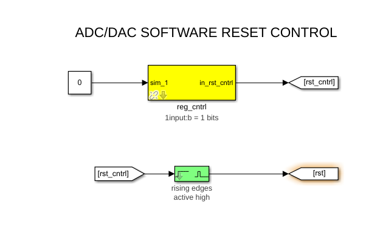
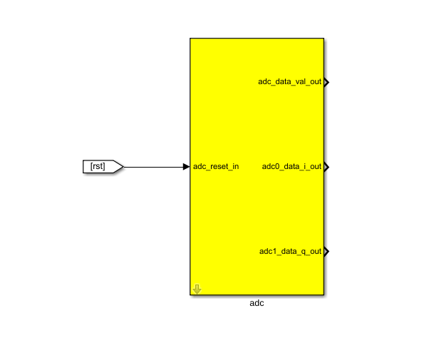
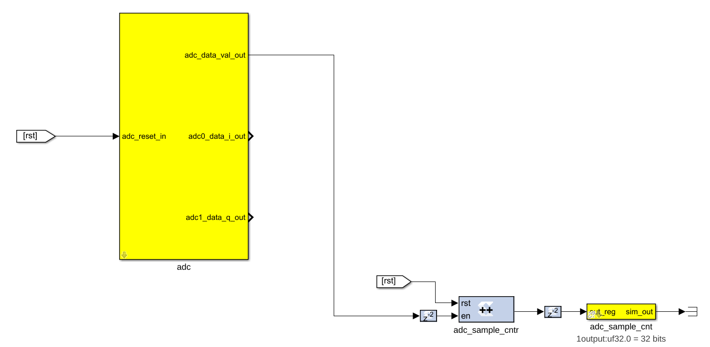
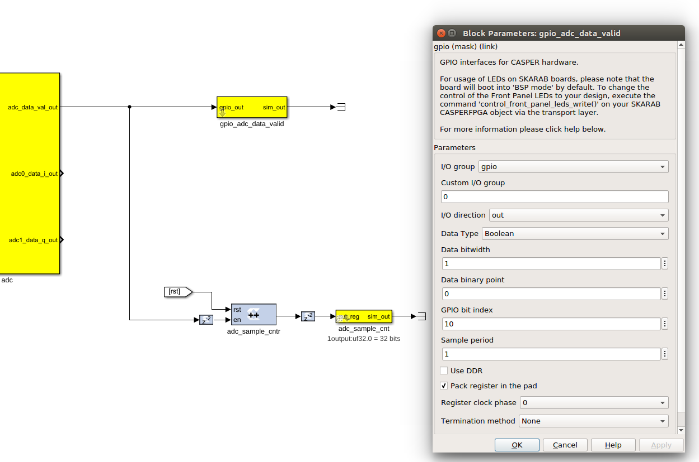
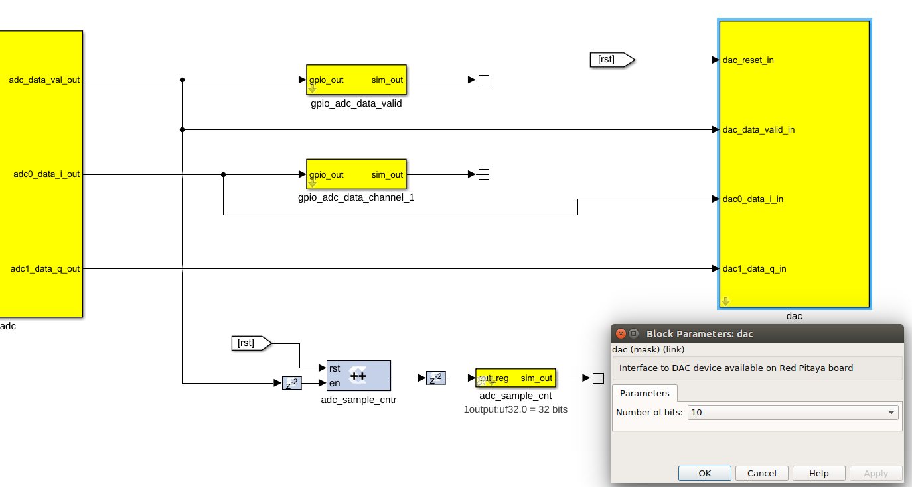
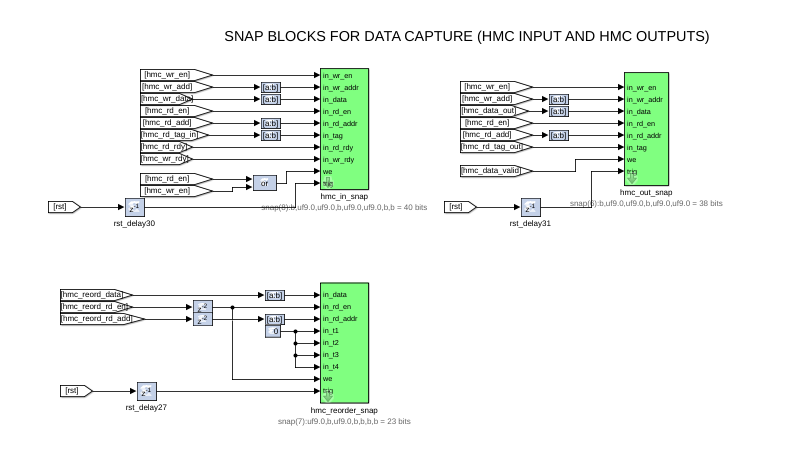
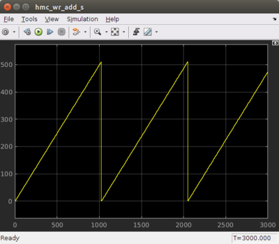
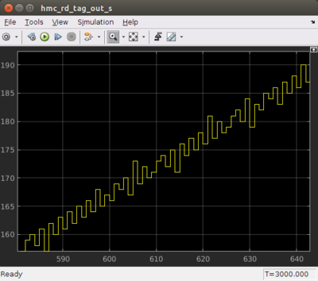
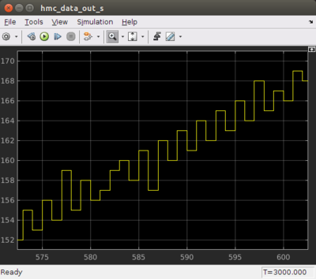
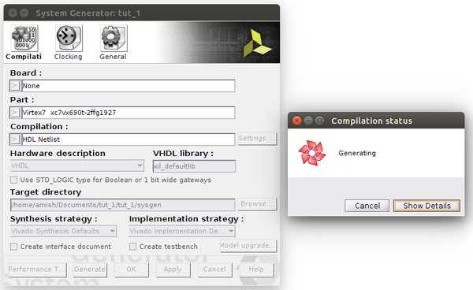

# Tutorial 3: ADC and DAC Interface
**AUTHORS:** A. Isaacson

**EXPECTED TIME:** 2 hours

## Introduction ##
In this tutorial, you will create a simple Simulink design which interfaces to both the dual channel ADC and interleaved DAC that are utilised on the Red Pitaya 125-10 boards - refer to [Red Pitaya Docs: ReadtheDocs](https://redpitaya.readthedocs.io/en/latest/) and [Red Pitaya Docs: Datasheets and Schematics] (https://github.com/casper-astro/red_pitaya_docs) for more information. In addition, we will learn to control the design remotely, using a supplied Python library for KATCP. 

In this tutorial, the user will be able to input a source sinusoidal signal from the signal generator on either channel 1 or channel 2 of the ADC input and be able to monitor these signals on the channel 1 and channel 2 DAC outputs using an oscilloscope. The user will be able to change the frequency and amplitude of the signal generator and notice the expected change on the oscilloscope if the Simulink design is connected correctly, as explained below. The user can verify the ADC digital data by using a logic analyser configured to read signed data and/or Simulink snap shots, which can be used to capture the ADC data. The python scripts can be utilised to read back this captured data and there are matlab scripts which can be utilised to display this data. The user will also be able to see what happens to the ADC and DAC data when the Digital Signal Processing (DSP) clock is increased from 125MHz to 200MHz.

## Required Equipment ##
The following equipment is required:
1) Oscilloscope, 50MHz, +/-2Vpp, Qty 1
2) Signal Generator, 1MHz-50MHz, +/-2Vpp, Qty 1
3) Logic Analyzer, 1GSps, 2 pods with fly leads, Qty 1
4) SMA Cables, Male to Male, Qty 2

## Background ##
The Red Pitaya 125-10 board consists of a dual channel 10 bit ADC and DAC - refer to [Red Pitaya Docs: ReadtheDocs](https://redpitaya.readthedocs.io/en/latest/) and [Red Pitaya Docs: Datasheets and Schematics] (https://github.com/casper-astro/red_pitaya_docs) for more information on the Red Pitaya. There are currently two versions of the Red Pitaya (125-10 and the 125-14) - refer to [Red Pitaya Hardware Comparison](https://redpitaya.readthedocs.io/en/latest/developerGuide/125-10/vs.html) for differences between the boards.

The Red Pitaya 125-10 is fitted with a single Analog Devices dual channel ADC AD9608 device. The ADC is sampled at 125MSPS and each ADC output digital channel is 10 bits wide, 1.8V LVCMOS. Refer to [Red Pitaya Docs: Datasheets and Schematics] (https://github.com/casper-astro/red_pitaya_docs) for the schematics of the 125-10. The ADC output is offset binary and converted to two's complement in the firmware running on the Zynq processor logic.

The Red Piatya 125-10 is fitted with a single Analog Devices dual channel DAC AD9767 device. The DAC digital input is offset binary, 10 bits, LVCMOS 3.3V and is converted from two's complement inside the firmware running on the Zynq processor logic. The second channel of the DAC is not connected, which means the DAC is utilised in the interleave mode - refer to DAC data sheet [Red Pitaya DAC Docs: Datasheets and Schematics] (https://github.com/casper-astro/red_pitaya_docs).

Feel free to spend some time reading the data sheets and looking at the schematics. This will be important for the bonus challenge at the end of the tutorial. 

## Create a new model ##
Start Matlab and open Simulink (either by typing 'simulink' on the Matlab command line, or by clicking on the Simulink icon in the taskbar). A template is provided for this tutorial with a pre-created firmware running LED function and Red Pitaya XSG core config or platform block and Xilinx System Generator block. Get a copy of this template and save it. Make sure the Red Pitaya XSG_core_config_block or platform block is configured for:

1) Hardware Platform: "RED_PITAYA:xc7z010"
 
2) User IP Clock source: "sys_clk"

3) User IP Clock Rate (MHz): 125 (125MHz clock derived from 125MHz ADC on-board clock). This clock domain is used for the Simulink design

The rest of the settings can be left as is. Click OK. 

### Add Reset logic ###
A very important piece of logic to consider when designing your system is how, when and what happens during reset. In this example we shall control our resets via a software register. We shall have one reset to reset the Simulink design counters and trigger the data capture snap blocks.  Construct reset and control circuitry as shown below.


#### Add a software register ####
Use a software register yellow block from the CASPER XPS Blockset-> Memory for the reg_cntrl block. Rename it to reg_cntrl. Configure the I/O direction to be From Processor. Attach one Constant blocks from the Simulink->Sources section of the Simulink Library Browser to the input of the software register and make the value 0 as shown above.

#### Add Goto Block ####
Add one Goto block from Simulink->Signal Routing. Configure them to have the tags as shown (rst_cntrl). These tags will be used by associated From (also found in Simulink->Signal Routing) blocks in other parts of the design. These help to reduce clutter in your design and are useful for control signals that are routed to many destinations. They should not be used a lot for data signals as it reduces the ease with which data flow can be seen through the system.

#### Add Edge_Detect block ####

Add From blocks from Simulink->Signal Routing rst_cntrl should go through an edge_detect block (rising and active high) to create a pulsed rst signal, which is used to trigger and reset the counters in the design. This is located in CASPER DSP Blockset -> Misc. Add Goto block rst from Simulink->Signal Routing. 

It should look as follows when you have added all the relevant registers:




### Add ADC and associated registers and gpio for debugging ###
We will now add the ADC yellow block in order to interface with the ADC device on the Red Pitaya.

#### Add the ADC yellow block for digital to analog interfacing ####
Add a Red Pitaya ADC yellow block from the CASPER XPS Blockset-> ADCs, as shown below. It will be used to interface to the ADC device on the Red Pitaya. Rename it to adc. Double click on the block to configure it and set the number of bits to be 10 bits wide. This should be hard coded for now. This will need to be changed for the bonus challenge exercise below.


Add the From block as shown below, which connects the reset to the ADC yellow block.



#### Add registers and gpio to provide ADC debugging ####
Add one yellow-block software register to provide an ADC sample counter (32 bits). Name them as shown below. The register should be
configured to send their values to the processor. Connect them to the ADC yellow block as shown below. Delay blocks are also required - you will find these under Xilinx Blockset -> Basic Elements in the Simulink Library Browser. 




In the event that you will be using the logic analyser, you will need to route the ADC data (channel 1) to the Logic Analyser connector (E1) on the Red Pitaya. In order to do this you will need to add two gpio yellow-blocks from CASPER XPS Blockset -> IO. The first GPIO is for the ADC data valid and the second GPIO yellow block is for the ADC channel 1 10 bit data. It should be connected as shown below for the first gpio for the ADC data valid:



It should be connected as shown below for the second gpio for the ADC 10 bit data on channel 1:


You will now be able to monitor the ADC data using the logic analyser connected to E1 on the Red Pitaya - refer to 125-10 schematics [Red Pitaya DAC Docs: Datasheets and Schematics] (https://github.com/casper-astro/red_pitaya_docs). 

### Add DAC ###
We will now add the DAC yellow block in order to interface with the DAC device on the Red Pitaya.

#### Add the DAC yellow block for analog to digital interfacing ####
Add a Red Pitaya DAC yellow block from the CASPER XPS Blockset-> DACs, as shown below. It will be used to interface to the DAC device on the Red Pitaya. Rename it to dac. Double click on the block to configure it and set the number of bits to be 10 bits wide. This should be hard coded for now. This will need to be changed for the bonus challenge exercise below. Add the From block as shown below, which connects the reset to the ADC yellow block and connect the ADC to the DAC as shown below.



The ADC and DAC functionality is now implemented in your Simulink design. It is now time to setup the ADC data capturing snap shot blocks.


### Buffers to capture ADC Data Valid, ADC Channel 1 and ADC Channel 2 ###
The HMC write data (input), HMC read data (output) and HMC reordered data need to be connected to bitfield snapshot blocks for data capture analysis (located in CASPER DSP Blockset->Scopes), as shown below. These blocks (hmc_in_snap, hmc_out_snap and hmc_reorder_snap) are identical internally. Using these blocks, we can capture data as it is written and compare it to the data we have read and finally to the data that has been reordered.

Bitfield snapshot blocks are a standard way of capturing snapshots of data in the CASPER tool-set. A bitfield snap block contains a single shared BRAM allowing capture of 128-bit words. 



The ctrl register in a snap block allows control of the capture. The least significant bit enables the capture. Writing a rising edge to this bit primes the snap block for capture. The 2nd least most significant bit allows the choice of a trigger source. The trigger can come from an external source or be internal and immediately. The 3rd most least significant bit allows you to choose the source of the valid signal associated with the data. This may also be supplied externally or be immediately enabled.

The basic principle of the snap block is that it is primed by the user and then waits for a trigger at which point it captures a block of data and then waits to be primed again. Once primed the addr output register returns an address of 0 and will increment as data is written into the BRAMs. Upon completion the addr register will contain the final address. Reading this value will show that the capture has completed and the results may be extracted from the shared BRAMs.

In the case of this tutorial, the arming and triggering is done via software. The trigger is the rst signal. The "we" signal on the snapshot blocks is the data valid signal. Configure and connect the snap blocks as shown above. The Convert (cast) blocks should all be to 9 bits. The delays should be as shown above, as this aligns the data correctly. The following settings should be used for the bitfield snapshot blocks: storage medium should be BRAM, number of samples ("2^?") should be 13, Data width 64, all boxes unchecked except "use DSP48s to implement counters", Pre-snapshot delay should be 0.

### HMC status registers ###
We shall now look at some registers to monitor the progress of our HMC writing and reading. We shall be able to check how many HMC write and read requests were issued and compare it to actual data read out of the memory via registers. We shall be able to check if the HMC is handling the throughput for the writing and reading via registers. 

#### Write status registers ####
- ''hmc_wr_cnt'' is attached to a counter that increments when the HMC write enable signal is asserted '1'. It keeps a count of the number of write requests.
- ''hmc_empty_wr_cnt'' is attached to a counter that will increment only when the HMC write enable signal and HMC write ready signal are asserted '1'. This is optional.
- ''hmc_wr_err'' is a register that allows us to check if the HMC is meeting the write throughput by incrementing a counter every time the write enable signal is asserted '1' when the HMC write ready signal is deasserted '0' i.e. the HMC yellow block is still busy reading from the FIFO and is not ready for more write data.

#### Read status registers ####
- ''hmc_rd_cnt'' is attached to a counter that increments when the HMC read enable signal is asserted '1'. It keeps a count of the number of read requests.
- ''hmc_empty_rd_cnt'' is attached to a counter that will increment only when the HMC read enable signal and HMC read ready signal are asserted '1'. This is optional.
- ''hmc_out_cnt'' is attached to a counter that will increment only when the HMC data valid signal is asserted '1'. It keeps a count of the number of valid read data coming from the memory.
- ''hmc_rd_err'' is a register that allows us to check if the HMC is meeting the read throughput by incrementing a counter every time the read enable signal is asserted '1' when the HMC read ready signal is deasserted '0' i.e. the HMC yellow block is still busy reading from the FIFO and is not ready for more write data.

From tag rst_cntrl should go through an edge_detect block (rising and active high) to create a pulsed rst signal, which is used to trigger and reset the counters in the design. This is located in CASPER DSP Blockset -> Misc. 

It should look as follows when you have added all the relevant registers:


You should now have a complete Simulink design. Compare it with the complete hmc tutorial *.slx model provided to you before continuing if unsure.

## Simulink Simulation ##

Press CTRL+D to compile the tutorial first and make sure there are no errors before simulating. If there are any errors then a diagnostic window will pop up and the errors can be addressed individually.

The design can be simulated with clock-for-clock accuracy directly from within Simulink. Set the number of clock cycles that you'd like to simulate and press the play button in the top toolbar. I would suggest make it 3000 in order to see a few cycles.


You can watch the simulation progress in the status bar in the bottom right. It may take a minute or two to simulate 3000 clock cycles.

Double-click on the scopes in the design to see what the signals look like on those lines. For example, the hmc_wr_add_s, hmc_rd_add_s, hmc_wr_en_s and hmc_rd_en_s scopes should look like below. You might have to press the Autoscale button to scale the scope appropriately. Note how the HMC read address is delayed by 256 clock cycles from the HMC write address. Note how the HMC write enable is aligned with the HMC read enable. 




Double-click on the scopes at the output of the HMC yellow block. The hmc_data_out_s and hmc_rd_tag_out_s scopes should look like below. You might have to press the Autoscale button to scale the scope appropriately. Note how the HMC read tag output data and the HMC read data output are out of sequence. This data is useless to us in this form. It needs to be reordered. 




Finally lets double-click on the scopes at the output of the HMC reordering function. The hmc_reord_rd_add_s, hmc_reord_rd_en_s and the hmc_reord_data_s scopes should look like below. You might have to press the Autoscale button to scale the scope appropriately. Note how the data increases in a linear ramp and then stays at 255 for a period of time and then begins to increase in a linear ramp until it reaches 511 and then resets. If you compare with the HMC reorder read enable signal then the data is actually still a ramp, as not all of the data is valid. This makes sense as the HMC reordering logic will only read from the BRAM once the write pointer is a address 255 and then again when the write pointer is at 511. This prevents the write and read pointers from clashing as explained above. 


Once you have verified that that design functions as you'd like, you're ready to compile for the FPGA...

## Compilation ##

It is now time to compile your design into a FPGA bitstream. This is explained below, but you can also refer to the Jasper How To document for compiling your toolflow design. This can be found in the ReadtheDocs mlib_devel documentation link:

[https://casper-toolflow.readthedocs.io](https://casper-toolflow.readthedocs.io/)
 
In order to compile this to an FPGA bitstream, execute the following command in the MATLAB Command Line window:

```bash
jasper
```

This will run the process to generate the FPGA bitstream and output Vivado compile messages to the MATLAB Command Line window along the way. During the compilation and build process Vivado's <i>system generator</i> will be run, and the windows below should pop up with the name of your slx file in the window instead of tut_1. The same applies below in the output file path - tut_1 will be replaced with the name of your slx file. In my case it is "tut_hmc". 



Execution of this command will result in an output .bof and .fpg file in the 'outputs' folder in the working directory of your Simulink model. <strong>Note: Compile time is approximately 45-50 minutes</strong>, so a pre-compiled binary (.fpg file) is made available to save time.


## Programming the FPGA ##
Reconfiguration of the SKARAB's SDRAM is done via the casperfpga python library. The casperfpga package for python, created by the SA-SKA group, wraps the Telnet commands in python. and is probably the most commonly used in the CASPER community. We will focus on programming and interacting with the FPGA using this method.

#### Getting the required packages ####

These are pre-installed on the server in the workshop and you do not need to do any further configuration, but if you are not working from the lab then refer to the How To Setup CasperFpga Python Packages document for setting up the python libraries for casperfpga. This can be found in the "casperfpga" repo wiki (to be deprecated) located in GitHub and the ReadtheDocs casperfpga documentation link:

[https://github.com/ska-sa/casperfpga/wiki](https://github.com/ska-sa/casperfpga/wiki)

[https://casper-toolflow.readthedocs.io](https://casper-toolflow.readthedocs.io/)

#### Copy your .fpg file to your NFS server ####

As per the previous figure, navigate to the outputs folder and (secure)copy this across to a test folder on the workshop server.

```bash
scp path_to/your/model_folder/your_model_name/outputs/your_fpgfile.fpg user@server:/path/to/test/folder/
```

#### Connecting to the board ####

SSH into the server that the SKARAB is connected to and navigate to the folder in which your .fpg file is stored.

Start interactive python by running:

```bash
ipython
```

Now import the fpga control library. This will automatically pull-in the KATCP library and any other required communications libraries.

```bash
 import casperfpga
```

To connect to the SKARAB we create an instance of the SKARAB board; let's call it fpga. The wrapper's fpgaclient initiator requires just one argument: the IP hostname or address of the SKARAB board.

```python
fpga = casperfpga.CasperFpga('skarab_name or ip_address')
```

The first thing we do is configure the FPGA.

```python
fpga.upload_to_ram_and_program('your_fpgfile.fpg')
```

All the available/configured registers can be displayed using:

```python
fpga.listdev()
```

The FPGA is now configured with your design. The registers can now be read back. For example, the HMC status register can be read back from the FPGA by using:

```python 
fpga.read_uint('hmc_status') or fpga.registers.hmc_status.read_uint();
```

The value returned should be 3, which indicates that the HMC has successfully completed initialisation and POST OK passes.

If you need to write to the reg_cntrl register then do the following:

```python
 fpga.registers.reg_cntrl.write(data_rate_sel= False), where data_rate_sel = False (29.44Gbps), data_rate_sel = True (58.88Gbps)
 
 fpga.registers.reg_cntrl.write(rst = 'pulse'), this creates a pulse on the rst signal
 
 fpga.registers.reg_cntrl.write(wr_rd_en= True) , where wr_rd_en = False (disable HMC write/read), wr_rd_en = True (Enable the HMC write/read)
```

Manually typing these commands by hand will be cumbersome, so it is better to create a Python script that will do all of this for you. This is described below.

#### Running a Python script and interacting with the FPGA ####
A pre-written python script, ''tut_hmc.py'' is provided. The code within the python script is well commented and won't be explained here. The user can read through the script in his/her own time. In summary, this script programs the fpga with your complied design (.fpg file), writes to the control registers, initates the HMC write & read process, reads back the HMC snap shot captured data and status registers while displaying them to the screen for analysis. In order to run this script you will need to edit the file and change the target SKARAB IP address and the *.fpg file, if they are different. The script is run using:

```python
python tut_hmc.py
```

If everything goes as expected, you should see a whole bunch of text on your screen - this is the output of the snap block and status register contents.

### Analysing the Display Data ###
You should see something like this:

```bash
 user@server:~$ python tut_hmc.py
 connecting to SKARAB...
 done
 programming the SKARAB...
 done
 arming snapshot blocks...
 done
 triggering the snapshots and reset the counters...
 done
 enabling the HMC write and read process...
 done
 reading the snapshots...
 done
 disabling the HMC write and read process...
 done
 reading back the status registers...
 hmc rd cnt: 55527004
 hmc wr cnt: 55527004
 hmc out cnt: 55527004
 hmc wr err: 0
 hmc rd err: 0
 hmc status: 3
 rx crc err cnt: 0
 hmc error status: 0
 done
 Displaying the snapshot block data...
 HMC SNAPSHOT CAPTURED INPUT
 -----------------------------
 Num wr_en wr_addr wr_data wr_rdy rd_en rd_addr rd_tag rd_rdy
 [0] 1 1 1 1 0 0 0 1
 [1] 1 2 2 1 0 0 0 1
 [2] 1 3 3 1 0 0 0 1
 [3] 1 4 4 1 0 0 0 1
 [4] 1 5 5 1 0 0 0 1
 [5] 1 6 6 1 0 0 0 1
 [6] 1 7 7 1 0 0 0 1
 [7] 1 8 8 1 0 0 0 1
 [8] 1 9 9 1 0 0 0 1
 [9] 1 10 10 1 0 0 0 1
 [10] 1 11 11 1 0 0 0 1
 ....
 [589] 1 78 78 1 1 462 462 1
 [590] 1 79 79 1 1 463 463 1
 [591] 1 80 80 1 1 464 464 1
 [592] 1 81 81 1 1 465 465 1
 [593] 1 82 82 1 1 466 466 1
 [594] 1 83 83 1 1 467 467 1
 [595] 1 84 84 1 1 468 468 1
 [596] 1 85 85 1 1 469 469 1
 [597] 1 86 86 1 1 470 470 1
 [598] 1 87 87 1 1 471 471 1
 [599] 1 88 88 1 1 472 472 1
 HMC SNAPSHOT CAPTURED OUTPUT
 -----------------------------
 Num hmc_read_tag_out hmc_data_out
 [1] 1 1
 [2] 2 2
 [3] 3 3
 [4] 4 4
 [5] 5 5
 [6] 6 6
 [7] 7 7
 [8] 8 8
 [9] 9 9
 [10] 10 10
 [11] 12 12
 [12] 11 11
 [13] 13 13
 ....
 [588] 75 75
 [589] 77 77
 [590] 78 78
 [591] 79 79
 [592] 80 80
 [593] 81 81
 [594] 82 82
 [595] 83 83
 [596] 84 84
 [597] 85 85
 [598] 86 86
 [599] 87 87
 HMC REORDER SNAPSHOT CAPTURED OUTPUT
 -------------------------------------
 Num rd_en rd_addr data_out
 [1] 1 1 1
 [2] 1 2 2
 [3] 1 3 3
 [4] 1 4 4
 [5] 1 5 5
 [6] 1 6 6
 [7] 1 7 7
 [8] 1 8 8
 [9] 1 9 9
 [10] 1 10 10
 [11] 1 11 11
 [12] 1 12 12
 [13] 1 13 13
 [14] 1 14 14
 [15] 1 15 15
 ....
 [588] 1 76 76
 [589] 1 77 77
 [590] 1 78 78
 [591] 1 79 79
 [592] 1 80 80
 [593] 1 81 81
 [594] 1 82 82
 [595] 1 83 83
 [596] 1 84 84
 [597] 1 85 85
 [598] 1 86 86
 [599] 1 87 87
```

The above results show that the HMC is meeting the 29.44Gbps throughput, as the HMC write error register (hmc_wr_err) and HMC read 
error register (hmc_rd_err) is 0, which means the HMC is always ready for data when the HMC write/read request occurs. Note that the HMC read count (hmc_rd_cnt), 
HMC write count (hmc_wr_cnt) and HMC read out count (hmc_out_cnt) are all equal, which is expected. Compare the HMC snapshot output data and the HMC reorder snapshot captured output data - notice how 
the HMC snapshot output data is out of sequence in places and the HMC snapshot reorder data is in sequence again. There is no missing data. This is how the HMC should work. 

Edit the tut_hmc.py script again and change the data rate to 58.88Gbps. Rerun as above and this time notice that the difference in the above registers and snapshot data. What do you see? You should see that
HMC read count, HMC write count and HMC read out count values do not match. The HMC write error register and HMC read error register should be non zero, which indicates that the HMC is asserting write and 
read requests when the HMC write and read ready signals are not asserted, which means the FIFO is not being cleared fast enough. The HMC read output data will still be out of sequence, but data will be lost. This
can be clearly seen in the HMC reorder snapshot captured output.

#### Other notes ####

• iPython includes tab-completion. In case you forget which function to use, try typing library_name.<tab><tab>

• There is also onboard help. Try typing library_name.function?

• Many libraries have onboard documentation stored in the string library_name.__doc__

• KATCP in Python supports asynchronous communications. This means you can send a command, register a callback for the response and continue to issue new commands even before you receive the response. You can achieve much greater speeds this way. The Python wrapper in the corr package does not currently make use of this and all calls are blocking. Feel free to use the lower layers to implement this yourself if you need it!

## Conclusion ##
This concludes the HMC Interface Tutorial for SKARAB. You have learned how to utilize the HMC interface on a SKARAB to write and read data to/from the HMC Mezzanine Card. You also learned how to further use Python to program the FPGA and control it remotely using casperfpga.
