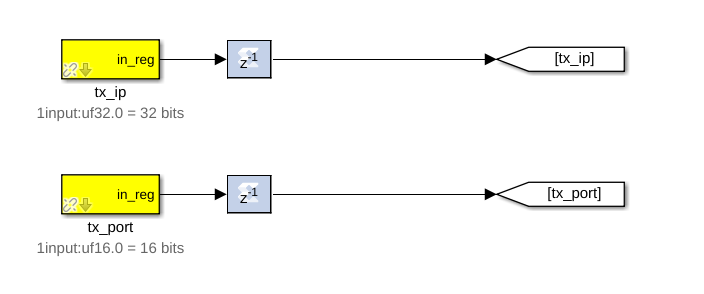
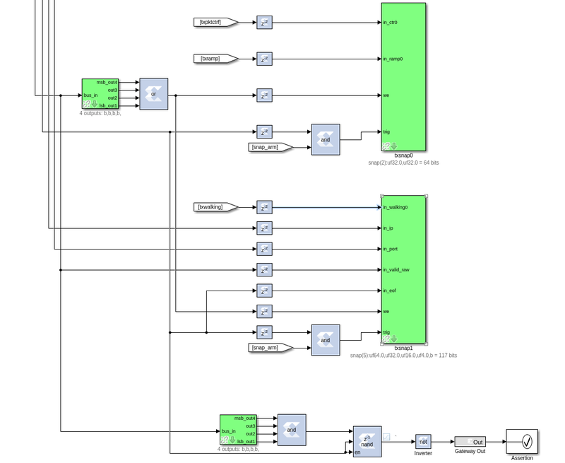
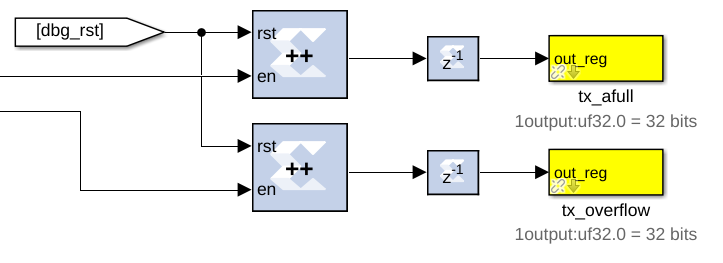
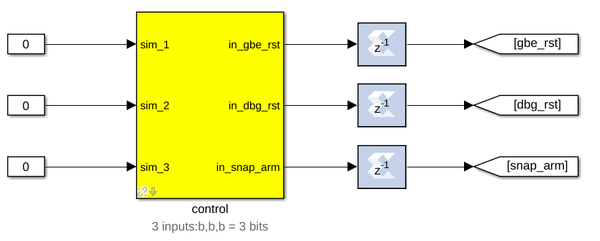
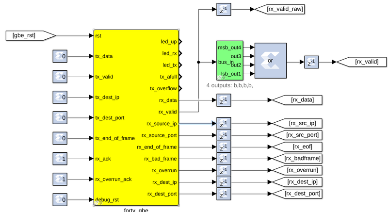
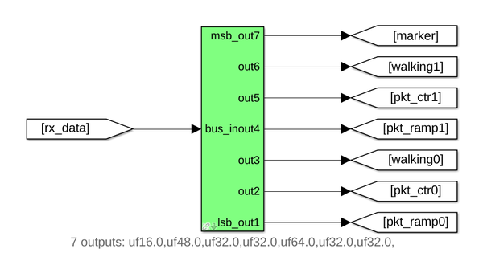
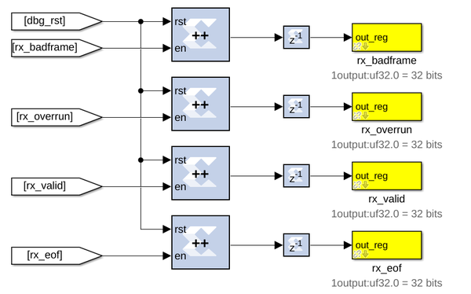

# Tutorial 2: 40GbE Interface

## Introduction ##
In this tutorial, you will create a simple Simulink design which uses the ROACH2's 40GbE ports to send data at high speeds to another port. This could just as easily be another ROACH board or a computer with a 40GbE network interface card. In addition, we will learn to control the design remotely, using a supplied Python library for KATCP. The UDP packets sent by the ROACH will be recorded to disk.

In this tutorial, a counter will be transmitted through one SFP+ port and back into another. This will allow a test of the communications link in terms of performance and reliability. This test can be used to test the link between boards and the effect of different cable lengths on communications quality.

## Background ##
For more info on the SKARAB please follow this link to the [SKARAB](https://github.com/casper-astro/casper-hardware/wiki/SKARAB) hardware platform.

Of particular interest for this tutorial is the section on the [QSFP+ Mezzanine Card](https://github.com/casper-astro/casper-hardware/wiki/SKARAB#QSFP_Mezzanine_Card)

The maximum payload length of the 40GbE core is 8192 bytes (implemented in BRAM) plus another 512 (implemented in distributed RAM) which is useful for an application header. These ports (and hence part of the 40 GbE cores) run at 156.25MHz, while the interface to your design runs at the FPGA clock rate (sys_clk, etc). The interface is asynchronous, and buffers are required at the clock boundary. For this reason, even if you send data between two SKARAB boards which are running off the same hard-wired clock, there will be jitter in the data. A second consideration is how often you clock values into the core when you try to send data. If your FPGA is running faster than the core, and you try and clock data in on every clock cycle, the buffers will eventually overflow. Likewise for receiving, if you send too much data to a board and cannot clock it out of the receive buffer fast enough, the receive buffers will overflow and you will lose data. In our design, we are clocking the FPGA at 200MHz, with the cores running at 156.25MHz. We will thus not be able to clock data into the TX buffer continuously for very long before it overflows. If this doesn't make much sense to you now, don't worry, it will become clear after you've tried it.

## Tutorial Outline ##
This tutorial will be run in an explain-and-explore kind of way. There are too many blocks for us to run through each one and its respective configuration. Hence, each section will be generally explained and it is up to you to explore the design and understand the detail. Please don't hesitate to ask any questions and if you are doing these tutorials outside of the CASPER workshop please email any questions to the casper email list.

This tutorial consists of 2 designs a transmitter and a receiver. We will look at the transmitting design first.

## Tx Design ##

As with the previous tutorial drop down a xilinx xsg block and then the skarab platform yellow block, configure the clock frequency to 170Mhz.

Firstly we use a software register to control our system. In this design we are using a single 32bit register with the lower 6 bits are used for the 40gbe core reset, the debug logic reset, the packet reset, transmit enable, packet enable and snap block arming. This software register also takes in some simulation stimuli. Try playing with these and simulating the design using the play button on the top of the window. It is advisable to use a short simulation time as more complex designs can take ages to simulate.

Each packet that is sent from the fpga fabric can be send to a specified IP and port, these are configurable and in this case are set via software registers. These could also be set dynamically from the fabric as required.

This is the start of the logic to build up our payload. The decimation register is used to control the rate at which packets are sent. Have a look at lines 307-312 of the tx python script to see how this value is calculated and used.

Here is the rest of the payload generation logic. We are creating 2 ramps and a walking 1 pattern. The payload is generated using a combination of counters, slice blocks, delays, adders and comparitors. The ramps and walking 1 are concatenated together and put into the payload buffer by toggling the tx_valid signal on the 40gbe core. The tx_data bus is 256 bits wide so only 256 bits can be clocked in on a clock cycle. The buffer can accept a payload of up to 8192 bytes. Once all the date we require is in the payload buffer we toggle the tx_end_of_frame signal to send the packet into the ether. 

As a method of debugging, the transmit side also as some snap blocks which can capture data as it is sent to the core. The snap block is a bram which can be triggered to capture data on a particular signal and then read out from software. They are very useful for debugging and checking the data at particular stages through your design. 

The design also has a counter that keeps track of each time the overflow or almost full lines are driven high by the core. This will tell us if we have any overflow or almost overflowing buffers.

Not take a look through the tx python script to see how the resisters are being set and the debug snap blocks are used to validate the data being sent. This should be well commented, but please ask questions where things aren't clear.

## Rx Design ##

For the receiver design do the same as the previous design by dropping down a XSG block and the SKARAB platform block. Configure the clock rate to 230Mhz. We want this to be well above the then the clock rate of the transmit design so that we can handle the variable rate from the transmitter and not overflow our buffers.

Again we have a control register which managed resets, enables and snap block triggering.

This is the receiving 40GbE. It the Tx side is all tied to 0 as this interface is not used. The Rx side is connected up to labels which are used to reduce the wires running around the design. 

The following blocks split out the walking 1 and the ramps from the received data.

Here each of the split data are written into snap blocks. The snap blocks are triggered by the end of frame signal and the write enable is driven by the rx_valid signal.

Here we have counters used to count any errors on the receives side. They are fed into software registers for access from software.

Here are more registers used for debugging, they count any errors in the expected data, the ramps and the walking 1.

This writes the packet header data into a snap block just to provide more debugging data.

Once you are finished examining the designs and feel that you have a good handle on them. Look through the python tx script. Try to figure out how to call the script with the correct parameters and files. You might have to scp the files to the control server. For the 2017 workshop this is not the same machine as the build machines. Then run it and see what data you can get out. You can also start an ipython session and manually connect run each of the commands.

As always please ask if you have any questions, of which I am sure there will be many.
