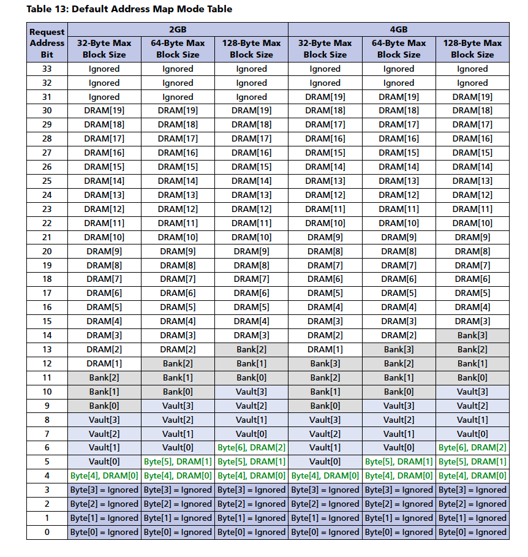
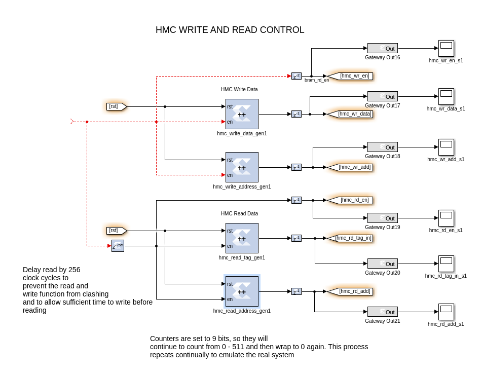
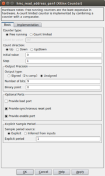
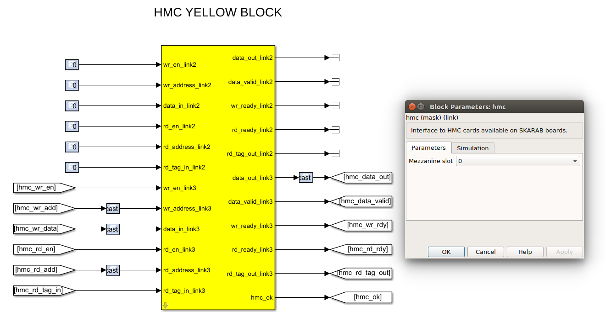
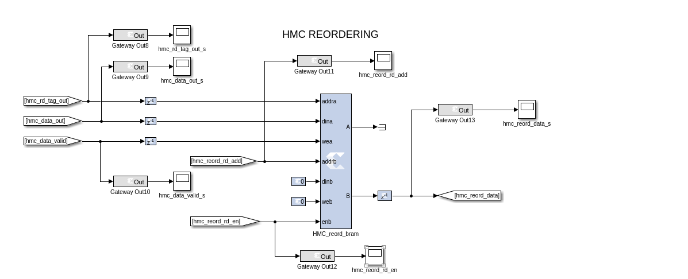
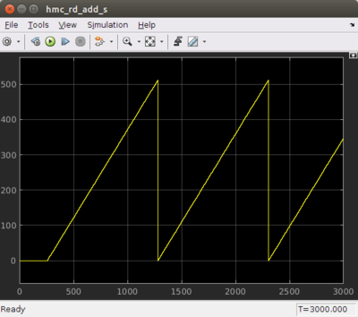
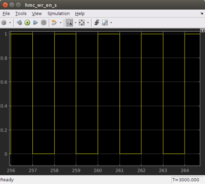
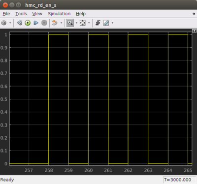
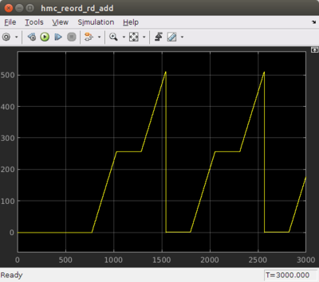

# Tutorial 3: HMC Interface

## Introduction ##
In this tutorial, you will create a simple Simulink design which writes and reads to/from the HMC Mezzanine Card that is plugged into the SKARAB Mezzanine 0 MegaArray slot - refer to [SKARAB](https://github.com/casper-astro/casper-hardware/wiki/SKARAB) for more information. In addition, we will learn to control the design remotely, using a supplied Python library for KATCP. 

In this tutorial, a counter will be used to generate HMC test write data. Another counter will be used to read the test data from the HMC. The write and read data rate can be controlled by a software register to read and write every second clock cycle or read and write every clock cycle. This test can be used to demonstrate the throughput that the HMC can handle. This tutorial will also explain why the HMC read data needs to be reordered and shows a way of doing this using BRAM with BRAM read and write control.

## Background ##
SKARAB boards have four MegaArray mezzanine slots. Mezzanine 3 is traditionally used for the QSFP+ Mezzanine Card, which makes provision for the 40GbE Interface functionality - refer to [SKARAB](https://github.com/casper-astro/casper-hardware/wiki/SKARAB). The rest of the Mezzanine slots (0, 1 and 2) can be used for the HMC Mezzanine Card. This tutorial assumes that the HMC Mezzanine Card is fitted in mezzanine 0 slot. The SKARAB board can have up to three HMC Mezzanine Cards.   

The HMC Mezzanine Card is fitted with a single Micron HMC MT43A4G80200 – 4GB 8H DRAM stack device. The HMC (Hybrid Memory Cube) Mezzanine Card, is a 4GB, serialised memory, which uses 16 x 10Gbps SERDES lanes to the FPGA per a mezzanine site. The HMC hardware works using the OpenHMC core designed by Juri Schmidt who works for the Computer Architecture Group at the University of Heidelberg [CAG](http://ra.ziti.uni-heidelberg.de/cag/) and [OpenHMC](http://ra.ziti.uni-heidelberg.de/cag/research/recent-research-projects/openhmc). The OpenHMC core is designed to be fully configurable, but this tutorial is using the configuration: 256 bit data transfer and 4 FLITS per a word. 

The HMC yellow block makes provision for two links: Link 2 and Link 3. Each Link uses 8 x TX/RX GTH full duplex lines rated at 10Gbps each. This can be higher, but we are using it at this rate. This means that theoretically each link can handle 80Gbps throughput. The reality is that the HMC interface uses a protocol (FLIT = Floating Unit), which has a 128 bit (64 bit header and 64 bit tail), so at least half of that data is header and so the actual throughput will be in the region of 40Gbps. This has been tested successfully at 32 Gbps, with both links active. This tutorial will only write and read from link 3, so can handle a throughput between 32Gbps - 40Gbps. This tutorial tests the HMC with a write/read throughput of 29.44Gbps (pass) and a write/read throughput of 58.88Gbps (fail). The user will see the difference in the HMC data and status monitoring when the HMC read and write mechanism is successful and compare it to when it is unsuccessful.      

The HMC memory has controller logic built in as well as stacked DRAM. This controller logic and stacked DRAM are divided into vaults. It is important to note that due to the DRAM refresh cycles when you request data (i.e. read) from the HMC you will not always get the reads returned to you in the correct order. The HMC will only return data that has been requested only when the vault is available. If the vault is not available then it will handle other requests that are available. This out of order return allows the HMC to meet the higher throughput, but it does mean that the data read from the HMC needs to reordered before using it. This tutorial will show you how to do this.

The HMC address scheme is user configurable, but also has set patterns and we are using one of the set patterns. The FLITs per a word (FPW) is also configurable, but the HMC yellow block is using 4 FLITS per a word. Each Flit is 128 bits, so 512 bits in total. The HMC is running at a 156.25MHz rate and the data width (after the header and tail have been removed) is 256bits. This gives a maximum data throughput of 256bits x 156.25MHz = 40Gbps. 

It is important to note that each write uses 3 x FLITS and each read uses 1 x FLIT, so if you try to interleave read and writes then there will be a loss of throughput as the HMC devices are not being accessed nominally, as the FLITS per a word is set to 4. It is important to write and read simultaneously in order to achieve the correct throughput. It is not possible to read and write from the same address simultaneously and so there needs to be an offset between the read and write address. This tutorial uses an offset between the write and read addresses.

The address structure also influences the overall latency in the device. If you access a vault from a link that is not hardware linked to the vault then there will be additional latency to move from one vault to another. There are 16 vaults for this particular HMC device. All links can access all the vaults. The hardware linking looks as follows:

Link 0: vault 0, 1, 2, 3 (Link 0 is not available)

Link 1: vault 4, 5, 6, 7 (Link 1 is not available)

Link 2: vault 8, 9, 10, 11

Link 3: vault 12, 13, 14, 15 

Therefore, using Link 2 and Link 3 try and use their corresponding vaults if the goal is to minimise latency, but in order to maximise throughput then circle the write and read address through all the vaults so that there will always be data available to process. This tutorial cycles through a limited address space to demonstrate this.

The HMC yellow block is using a 4GB device with 32 Byte Max Block size, which is shown in Table 13 below. The HMC firmware handles the request address bits 0-4 and 32-33. The HMC yellow block write and read address is 27 bits, which is mapped to request address bit 5-31 of the 32-Byte Max Block Size, which is shown in Table 13 below. Bit 5 is the LSB and bit 31 is the MSB.  



More information on the HMC device (Rev D) and OpenHMC controller (Rev 1.5) can be found under the following repo (in the "hmc" folder):

[https://github.com/ska-sa/skarab_docs](https://github.com/ska-sa/skarab_docs) (master branch)

## Setup ##
Refer to the [Casper Caltech Workshop 2017 Tutorials Help Page](https://casper.berkeley.edu/wiki/Casper_Caltech_Workshop_2017_Tutorials_Help_Page) for how to setup. The SKARAB boards are also already on a separate network connected to one of the servers.

## Create a new model ##
Start Matlab and open Simulink (either by typing 'simulink' on the Matlab command line, or by clicking on the Simulink icon in the taskbar). A template is provided for this tutorial with a pre-created HMC reordering function, SKARAB XSG core config block, Xilinx System Generator block and a 40GbE yellow block. Get a copy of this template and save it. Make sure the SKARAB XSG_core_config_block is configured for:

1) Hardware Platform: "SKARAB:xc7vx690t"
 
2) User IP Clock source: "sys_clk"

3) User IP Clock Rate (MHz): 230 (230MHz clock derived from 156.25MHz on-board clock). This clock domain is used for the Simulink design

The rest of the settings can be left as is. Click OK. 

The 40GbE yellow block needs to be added as the SKARAB Board Support Package (BSP) is currently integrated in this block. If the 40GbE yellow block is not included then your Simulink will not compile as the SKARAB BSP will be missing.

### Add control and reset logic ###
A very important piece of logic to consider when designing your system is how, when and what happens during reset. In this example we shall control our resets via a software register. We shall have one reset to reset the HMC design counters and trigger the data capture snap blocks. We shall have one data rate select, which will control/select the throughput through the HMC and we shall have one HMC write/read enable signal, which allows the user to disable/enable the process, so that the hmc read counter, write counter and hmc out counter all represent the same instant in time.  Construct reset and control circuitry as shown below.


#### Add a software register ####
Use a software register yellow block from the CASPER XPS Blockset for the reg_cntrl block. Rename it to reg_cntrl. Configure the I/O direction to be From Processor. Attach two Constant blocks from the Simulink->Sources section of the Simulink Library Browser to the input of the software register and make the value 0 and 1 as shown above.

#### Add Goto Blocks ####
Add three Goto blocks from Simulink->Signal Routing. Configure them to have the tags as shown (rst_cntrl, data_rate_sel and wr_rd_en). These tags will be used by associated From (also found in Simulink->Signal Routing) blocks in other parts of the design. These help to reduce clutter in your design and are useful for control signals that are routed to many destinations. They should not be used a lot for data signals as it reduces the ease with which data flow can be seen through the system.

### Add a write and read counter to generate test data for the HMC ###

#### Add Counter Blocks ####

Add four Counter blocks from Xilinx Blockset->Basic Elements and configure it to be unsigned, free-running, 9-bits, incrementing by 1 as shown below - the block parameters are the same for all counters. The first counter represents the write data, the second counter represents the write address, the third counter represents the read data and the fourth counter represents the read address as shown below. 

#### Add Delay Blocks ####

Add the delay blocks from Xilinx Blockset->Basic Elements and configure it as shown below. The read enable is delayed by 256 clock cycles in order to prevent the read and write address from clashing. It also allows ample time for a write to occur before reading occurs. The HMC write enable and read enable signal are aligned in order to ensure that the HMC reading and writing happen concurrently.

#### Add Goto and From Blocks ####
Add Goto and From blocks from Simulink->Signal Routing as shown below. Configure them to have the tags as shown.

#### Add Gateway Out Blocks and Scopes ####
Add Gateway Out blocks from Xilinx Blockset->Data Types as shown below. Remember to disable the "translate into output port" check. The purpose of the gateway out block is because we are connecting Xilinx blocks to the Simulink scope. You don't need a gateway, but a warning will be generated when you compile the simulink block (Ctrl+D).

Add Scopes from Simulink->Sinks, in order to visually display the signals after simulation as shown below.


In simulation this circuit will generate a write & read address and data counter from 0 to 511 and the counter will wrap around after 511 as it is only 9 bits. This will allow us to generate simple test data for the HMC in order to analyse the memory writing and reading process. If the data is the same as the address then it is easier to see what is going on. Also, if the counter overflows all the time then it is easier to compare the HMC write with the HMC read and the HMC reorder process.

The dotted red-lines represent the counter enable signal path and that is generated by the data rate control function in the section below.




### Add functionality to control the write and read data rate ###
As mentioned earlier in this tutorial, it is impossible to perform HMC read and write at the full clock rate. This would mean writing/reading a 256 bit word at 230MHz (58.88Gbps), and the HMC firmware supports up to a maximum of 256 bit at 156.25MHz (40Gbps) data throughput. We thus want to limit the data rate, so that the HMC firmware FIFOs do not overflow. We thus add circuitry to limit the data rate as shown below. The logic that we have added below can either enable the HMC write and read counters every clock cycle or enable the HMC write and read counters every second cycle. There is a multiplexer, which is controlled via a software register that can select either rate for demonstration purposes.

Implement the function that performs the write and read data rate control as shown below:

#### Add a Counter Block ####

Add one Counter block from Xilinx Blockset->Basic Elements and configure it to be unsigned, free-running, 2-bits, incrementing by 1 as shown below. This counter is used to divide the data rate by 2 using the LSB of the counter.

#### Add Xilinx Constant Blocks ####

Add three Constant blocks from Xilinx Blockset->Basic Elements and configure it to be a 1 or a 0 as shown below. All constants must be boolean.

#### Add Slice Block ####
Add a Slice block from the Xilinx Blockset-> Basic Elements, as shown below. Configure it to select the least significant bit. 

#### Add From Blocks ####
Add From blocks from Simulink->Signal Routing as shown below. Configure them to have the tags as shown below.

#### Add Xilinx Convert (cast) Block ####
Add a Xilinx Convert block from Xilinx Blockset-> Data Types. Configure it to be boolean.

#### Add Xilinx Bus Multiplexer (Mux) Block ####
Add a Xilinx Mux block from Xilinx Blockset-> Basic Elements. Configure it to have two inputs, 1 clock cycle latency and full output precision, as shown below.

#### Add Xilinx Logical Block ####
Add a Xilinx logical block from Xilinx Blockset-> Basic Elements. Configure it to have four inputs, no latency and full output precision, as shown below.

#### Add Gateway Out and To Workspace Block (Optional) ####
Add Gateway Out blocks from Xilinx Blockset->Data Types as shown below. Remember to disable the "translate into output port" check. The purpose of the gateway out block is because we are connecting Xilinx blocks to the Simulink workspace variable. You don't need a gateway, but a warning will be generated when you compile the simulink block (Ctrl+D).

Add to To Workspace blocks from Simulink->Sinks as shown below. This captures all the simulation data to the Matlab workspace variable. This makes it easier to see if data is aligned than just looking at the scope display. This step is optional, but you are welcome to try it.

The dotted red lines indicates where it interfaces with the HMC write and read control functionality in the section above. 


### Add HMC and associated registers for error monitoring ###
We will now add the HMC yellow block in order to write and read to the HMC Mezzanine Card on the SKARAB.

#### Add the HMC yellow block for memory accessing ####
Add a HMC yellow block from the CASPER XPS Blockset, as shown below. It will be used to write and read data to/from the HMC memory on the Mezzanine Card. Rename it to hmc. Double click on the block to configure it and set it to be associated with Mezzanine slot 0. Make sure the simulation memory depth is set to 22 and the latency is set to 5. The randomise option should be checked, as this will ensure that the read HMC data is out of sequence, which emulates the operation of the HMC. This is explained above. 

Add the Xilinx constant blocks as shown below - the tag is 9 bits, the data is 256 bits, the address is 27 bits and the rest is boolean. Add Xilinx cast blocks to write data (cast to 256 bits), write/read address (cast to 27 bits) and hmc data out (cast to 9 bits). Add the GoTo and From blocks and name them as shown below.

Link 2 is not used, so the outputs can be terminated, as shown below. Add the terminator block from Simulink->Sinks
 


#### Add registers to provide HMC status monitoring ####
Add three yellow-block software registers to provide the HMC status (2 bits), HMC receive CRC error counter (16 bits) and the HMC receive FLIT protocol error status (7 bits). Name them as shown below. The registers should be
configured to send their values to the processor. Connect them to the HMC yellow block as shown below using GoTo blocks. A Convert (cast) block is required to interface with the 32 bit registers. Delay blocks are also required. To workspace blocks from Simulink->Sinks are attached to the simulation outputs of the software registers.

The HMC status is made up of the HMC initialisation done and HMC Power On Self Test (POST) OK flags. It takes a maximum of 1.2s for the HMC lanes to align and the initialisation process to complete. Once this is done then internally generated test data is written into the HMC. The data is then read out and compared with the data written in. If there is a match then POST passes and the POST OK flag is set to '1'. In this case, HMC initialisation done will be '1' when the initialisation is successful and the POST process has finished. The POST OK flag will only be set to '1' when the memory test is successful. Therefore, the user can only start writing and reading to/from the HMC when init_done and post_ok flag are both '1'. If any flags are '0' then the HMC did not properly start up. Refer to the HMC Data Rate Control functionality above, which uses these flags to only start the write and read process when they are asserted.

The HMC receive CRC error counter will continue to increment if there are receive checksum errors encountered by the HMC firmware. This should always be 0.

The HMC receive FLIT protocol error status register is 7 bits. If any of these bits are '1' then this means an error has occurred. This should always be '0'. In order to decode what this error means there is a table in the HMC data sheet on page 48 Table 20.


### Implement the HMC reordering functionality ###
We will now implement logic to reorder the data that is read out of sequence from the HMC. This is critical, as the data is no use to us if it is out of sequence. This is already included in the template for this tutorial, so please use this functionality as is to save time. Some details are provided here for completeness.

The logic below looks complicated, but it is not. The HMC does not read back the data in the order it was requested due to how the HMC vaults operate and the DRAM refresh cycles. This makes the HMC readback undeterministic. The HMC reorder BRAM (512 Deep) reorders all the data read back from the HMC. This will synchronise the reorder readouts by using the read out tag as the write address of the reorder BRAM. It turns out through experience that the maximum delay can be in the order of 256 tags, when the data is requested. The function below does the following:

1) It ensures that the HMC has written at least 256 words into the reorder BRAM before reading out
of the reorder BRAM.

2) It makes sure the read pointer does not exceed the write pointer i.e. do not read data that has not been written yet.

3) Once the read pointer reaches count 256 then it waits until the write pointer count is at 512 and then continues to read the rest of the reorder BRAM while the write pointer starts from 0 again. This prevents the write and read pointers from clashing. This is essentially a bank swopping control mechanism.




### Buffers to capture HMC write, HMC read and HMC reordered read data ###
The HMC write data (input), HMC read data (output) and HMC reordered data need to be connected to bitfield snapshot blocks for data capture analysis (located in CASPER DSP Blockset->Scopes), as shown below. These blocks (hmc_in_snap, hmc_out_snap and hmc_reorder_snap) are identical internally. Using these blocks, we can capture data as it is written and compare it to the data we have read and finally to the data that has been reordered.

Bitfield snapshot blocks are a standard way of capturing snapshots of data in the CASPER tool-set. A bitfield snap block contains a single shared BRAM allowing capture of 128-bit words. 


The ctrl register in a snap block allows control of the capture. The least significant bit enables the capture. Writing a rising edge to this bit primes the snap block for capture. The 2nd least most significant bit allows the choice of a trigger source. The trigger can come from an external source or be internal and immediately. The 3rd most least significant bit allows you to choose the source of the valid signal associated with the data. This may also be supplied externally or be immediately enabled.

The basic principle of the snap block is that it is primed by the user and then waits for a trigger at which point it captures a block of data and then waits to be primed again. Once primed the addr output register returns an address of 0 and will increment as data is written into the BRAMs. Upon completion the addr register will contain the final address. Reading this value will show that the capture has completed and the results may be extracted from the shared BRAMs.

In the case of this tutorial, the arming and triggering is done via software. The trigger is the rst signal. The "we" signal on the snapshot blocks is the data valid signal. Configure and connect the snap blocks as shown above. The Convert (cast) blocks should all be to 9 bits. The delays should be as shown above, as this aligns the data correctly. The following settings should be used for the bitfield snapshot blocks: storage medium should be BRAM, number of samples (2^?) should be 13, Data width 64, all boxes unchecked except "use DSP48s to implement counters", Pre-snapshot delay should be 0.

### HMC status registers ###
We shall now look at some registers to monitor the progress of our HMC writing and reading. We shall be able to check how many HMC write and read requests were issued and compare it to actual data read out of the memory via registers. We shall be able to check if the HMC is handling the throughput for the writing and reading via registers. 

#### Write status registers ####
- ''hmc_wr_cnt'' is attached to a counter that increments when the HMC write enable signal is asserted '1'. It keeps a count of the number of write requests.
- ''hmc_empty_wr_cnt'' is attached to a counter that will increment only when the HMC write enable signal and HMC write ready signal are asserted '1'. This is optional.
- ''hmc_wr_err'' is a register that allows us to check if the HMC is meeting the write throughput by incrementing a counter every time the write enable signal is asserted '1' when the HMC write ready signal is deasserted '0' i.e. the HMC yellow block is still busy reading from the FIFO and is not ready for more write data.

#### Read status registers ####
- ''hmc_rd_cnt'' is attached to a counter that increments when the HMC read enable signal is asserted '1'. It keeps a count of the number of read requests.
- ''hmc_empty_rd_cnt'' is attached to a counter that will increment only when the HMC read enable signal and HMC read ready signal are asserted '1'. This is optional.
- ''hmc_out_cnt'' is attached to a counter that will increment only when the HMC data valid signal is asserted '1'. It keeps a count of the number of valid read data coming from the memory.
- ''hmc_rd_err'' is a register that allows us to check if the HMC is meeting the read throughput by incrementing a counter every time the read enable signal is asserted '1' when the HMC read ready signal is deasserted '0' i.e. the HMC yellow block is still busy reading from the FIFO and is not ready for more write data.

From tag rst_cntrl should go through an edge_detect block (rising and active high) to create a pulsed rst signal, which is used to trigger and reset the counters in the design. This is located in CASPER DSP Blockset -> Misc. 

It should look as follows when you have added all the relevant registers:


You should now have a complete Simulink design. Compare it with the complete hmc tutorial *.slx model provided to you before continuing if unsure.

## Simulink Simulation ##

Press CTRL+D to compile the tutorial first and make sure there are no errors before simulating. If there are any errors then a diagnostic window will pop up and the errors can be addressed individually.

The design can be simulated with clock-for-clock accuracy directly from within Simulink. Set the number of clock cycles that you'd like to simulate and press the play button in the top toolbar. I would suggest make it 3000 in order to see a few cycles.


You can watch the simulation progress in the status bar in the bottom right. It may take a minute or two to simulate 3000 clock cycles.

Double-click on the scopes in the design to see what the signals look like on those lines. For example, the hmc_wr_add_s, hmc_rd_add_s, hmc_wr_en_s and hmc_rd_en_s scopes should look like below. You might have to press the Autoscale button to scale the scope appropriately. Note how the HMC read address is delayed by 256 clock cycles from the HMC write address. Note how the HMC write enable is aligned with the HMC read enable. 







Double-click on the scopes at the output of the HMC yellow block. The hmc_data_out_s and hmc_rd_tag_out_s scopes should look like below. You might have to press the Autoscale button to scale the scope appropriately. Note how the HMC read tag output data and the HMC read data output are out of sequence. This data is useless to us in this form. It needs to be reordered. 


Finally lets double-click on the scopes at the output of the HMC reordering function. The hmc_reord_rd_add_s, hmc_reord_rd_en_s and the hmc_reord_data_s scopes should look like below. You might have to press the Autoscale button to scale the scope appropriately. Note how the data increases in a linear ramp and then stays at 255 for a period of time and then begins to increase in a linear ramp until it reaches 511 and then resets. If you compare with the HMC reorder read enable signal then the data is actually still a ramp, as not all of the data is valid. This makes sense as the HMC reordering logic will only read from the BRAM once the write pointer is a address 255 and then again when the write pointer is at 511. This prevents the write and read pointers from clashing as explained above. 




Once you have verified that that design functions as you'd like, you're ready to compile for the FPGA...

## Compilation ##

It is now time to compile your design into a FPGA bitstream. This is explained below, but you can also refer to the Jasper How To document for compiling your toolflow design. This can be found in the casper-astro "mlib_devel" repo wiki in GitHub:

[https://github.com/casper-astro/mlib_devel/wiki](https://github.com/casper-astro/mlib_devel/wiki)
 
In order to compile this to an FPGA bitstream, execute the following command in the MATLAB Command Line window:

```bash
jasper
```

This will run the process to generate the FPGA bitstream and output Vivado compile messages to the MATLAB Command Line window along the way. During the compilation and build process Vivado's <i>system generator</i> will be run, and the windows below should pop up with the name of your slx file in the window instead of tut_1. The same applies below in the output file path - tut_1 will be replaced with the name of your slx file. In my case it is "tut_hmc". 


Execution of this command will result in an output .bof and .fpg file in the 'outputs' folder in the working directory of your Simulink model. <strong>Note: Compile time is approximately 45-50 minutes</strong>, so a pre-compiled binary (.fpg file) is made available to save time.


## Programming the FPGA ##
Reconfiguration of the SKARAB's SDRAM is done via the casperfpga python library. The casperfpga package for python, created by the SA-SKA group, wraps the Telnet commands in python. and is probably the most commonly used in the CASPER community. We will focus on programming and interacting with the FPGA using this method.

#### Getting the required packages ####

These are pre-installed on the server in the workshop and you do not need to do any further configuration, but if you are not working from the lab then refer to the How To Setup CasperFpga Python Packages document for setting up the python libraries for casperfpga. This can be found in the "casperfpga" repo wiki located in GitHub:

[https://github.com/ska-sa/casperfpga/wiki](https://github.com/ska-sa/casperfpga/wiki)

#### Copy your .fpg file to your NFS server ####

As per the previous figure, navigate to the outputs folder and (secure)copy this across to a test folder on the workshop server.

```bash
scp path_to/your/model_folder/your_model_name/outputs/your_fpgfile.fpg user@server:/path/to/test/folder/
```

#### Connecting to the board ####

SSH into the server that the SKARAB is connected to and navigate to the folder in which your .fpg file is stored.

Start interactive python by running:

```bash
ipython
```

Now import the fpga control library. This will automatically pull-in the KATCP library and any other required communications libraries.

```bash
 import casperfpga
```

To connect to the SKARAB we create an instance of the SKARAB board; let's call it fpga. The wrapper's fpgaclient initiator requires just one argument: the IP hostname or address of the SKARAB board.

```python
fpga = casperfpga.CasperFpga('skarab_name or ip_address')
```

The first thing we do is configure the FPGA.

```python
fpga.upload_to_ram_and_program('your_fpgfile.fpg')
```

All the available/configured registers can be displayed using:

```python
fpga.listdev()
```

The FPGA is now configured with your design. The registers can now be read back. For example, the HMC status register can be read back from the FPGA by using:

```python 
fpga.read_uint('hmc_status') or fpga.registers.hmc_status.read_uint();
```

The value returned should be 3, which indicates that the HMC has successfully completed initialisation and POST OK passes.

If you need to write to the reg_cntrl register then do the following:

```python
 fpga.registers.reg_cntrl.write(data_rate_sel= False), where data_rate_sel = False (29.44Gbps), data_rate_sel = True (58.88Gbps)
 
 fpga.registers.reg_cntrl.write(rst = 'pulse'), this creates a pulse on the rst signal
 
 fpga.registers.reg_cntrl.write(wr_rd_en= True) , where wr_rd_en = False (disable HMC write/read), wr_rd_en = True (Enable the HMC write/read)
```

Manually typing these commands by hand will be cumbersome, so it is better to create a Python script that will do all of this for you. This is described below.

#### Running a Python script and interacting with the FPGA ####
A pre-written python script, ''tut_hmc.py'' is provided. The code within the python script is well commented and won't be explained here. The user can read through the script in his/her own time. In summary, this script programs the fpga with your complied design (.fpg file), writes to the control registers, initates the HMC write & read process, reads back the HMC snap shot captured data and status registers while displaying them to the screen for analysis. In order to run this script you will need to edit the file and change the target SKARAB IP address and the *.fpg file, if they are different. The script is run using:

```python
python tut_hmc.py
```

If everything goes as expected, you should see a whole bunch of text on your screen - this is the output of the snap block and status register contents.

### Analysing the Display Data ###
You should see something like this:

```bash
 user@server:~$ python tut_hmc.py
 connecting to SKARAB...
 done
 programming the SKARAB...
 done
 arming snapshot blocks...
 done
 triggering the snapshots and reset the counters...
 done
 enabling the HMC write and read process...
 done
 reading the snapshots...
 done
 disabling the HMC write and read process...
 done
 reading back the status registers...
 hmc rd cnt: 55527004
 hmc wr cnt: 55527004
 hmc out cnt: 55527004
 hmc wr err: 0
 hmc rd err: 0
 hmc status: 3
 rx crc err cnt: 0
 hmc error status: 0
 done
 Displaying the snapshot block data...
 HMC SNAPSHOT CAPTURED INPUT
 -----------------------------
 Num wr_en wr_addr wr_data wr_rdy rd_en rd_addr rd_tag rd_rdy
 [0] 1 1 1 1 0 0 0 1
 [1] 1 2 2 1 0 0 0 1
 [2] 1 3 3 1 0 0 0 1
 [3] 1 4 4 1 0 0 0 1
 [4] 1 5 5 1 0 0 0 1
 [5] 1 6 6 1 0 0 0 1
 [6] 1 7 7 1 0 0 0 1
 [7] 1 8 8 1 0 0 0 1
 [8] 1 9 9 1 0 0 0 1
 [9] 1 10 10 1 0 0 0 1
 [10] 1 11 11 1 0 0 0 1
 ....
 [589] 1 78 78 1 1 462 462 1
 [590] 1 79 79 1 1 463 463 1
 [591] 1 80 80 1 1 464 464 1
 [592] 1 81 81 1 1 465 465 1
 [593] 1 82 82 1 1 466 466 1
 [594] 1 83 83 1 1 467 467 1
 [595] 1 84 84 1 1 468 468 1
 [596] 1 85 85 1 1 469 469 1
 [597] 1 86 86 1 1 470 470 1
 [598] 1 87 87 1 1 471 471 1
 [599] 1 88 88 1 1 472 472 1
 HMC SNAPSHOT CAPTURED OUTPUT
 -----------------------------
 Num hmc_read_tag_out hmc_data_out
 [1] 1 1
 [2] 2 2
 [3] 3 3
 [4] 4 4
 [5] 5 5
 [6] 6 6
 [7] 7 7
 [8] 8 8
 [9] 9 9
 [10] 10 10
 [11] 12 12
 [12] 11 11
 [13] 13 13
 ....
 [588] 75 75
 [589] 77 77
 [590] 78 78
 [591] 79 79
 [592] 80 80
 [593] 81 81
 [594] 82 82
 [595] 83 83
 [596] 84 84
 [597] 85 85
 [598] 86 86
 [599] 87 87
 HMC REORDER SNAPSHOT CAPTURED OUTPUT
 -------------------------------------
 Num rd_en rd_addr data_out
 [1] 1 1 1
 [2] 1 2 2
 [3] 1 3 3
 [4] 1 4 4
 [5] 1 5 5
 [6] 1 6 6
 [7] 1 7 7
 [8] 1 8 8
 [9] 1 9 9
 [10] 1 10 10
 [11] 1 11 11
 [12] 1 12 12
 [13] 1 13 13
 [14] 1 14 14
 [15] 1 15 15
 ....
 [588] 1 76 76
 [589] 1 77 77
 [590] 1 78 78
 [591] 1 79 79
 [592] 1 80 80
 [593] 1 81 81
 [594] 1 82 82
 [595] 1 83 83
 [596] 1 84 84
 [597] 1 85 85
 [598] 1 86 86
 [599] 1 87 87
```

The above results show that the HMC is meeting the 29.44Gbps throughput, as the HMC write error register (hmc_wr_err) and HMC read 
error register (hmc_rd_err) is 0, which means the HMC is always ready for data when the HMC write/read request occurs. Note that the HMC read count (hmc_rd_cnt), 
HMC write count (hmc_wr_cnt) and HMC read out count (hmc_out_cnt) are all equal, which is expected. Compare the HMC snapshot output data and the HMC reorder snapshot captured output data - notice how 
the HMC snapshot output data is out of sequence in places and the HMC snapshot reorder data is in sequence again. There is no missing data. This is how the HMC should work. 

Edit the tut_hmc.py script again and change the data rate to 58.88Gbps. Rerun as above and this time notice that the difference in the above registers and snapshot data. What do you see? You should see that
HMC read count, HMC write count and HMC read out count values do not match. The HMC write error register and HMC read error register should be non zero, which indicates that the HMC is asserting write and 
read requests when the HMC write and read ready signals are not asserted, which means the FIFO is not being cleared fast enough. The HMC read output data will still be out of sequence, but data will be lost. This
can be clearly seen in the HMC reorder snapshot captured output.

#### Other notes ####

• iPython includes tab-completion. In case you forget which function to use, try typing library_name.<tab><tab>

• There is also onboard help. Try typing library_name.function?

• Many libraries have onboard documentation stored in the string library_name.__doc__

• KATCP in Python supports asynchronous communications. This means you can send a command, register a callback for the response and continue to issue new commands even before you receive the response. You can achieve much greater speeds this way. The Python wrapper in the corr package does not currently make use of this and all calls are blocking. Feel free to use the lower layers to implement this yourself if you need it!

## Conclusion ##
This concludes the HMC Interface Tutorial for SKARAB. You have learned how to utilize the HMC interface on a SKARAB to write and read data to/from the HMC Mezzanine Card. You also learned how to further use Python to program the FPGA and control it remotely using casperfpga.
