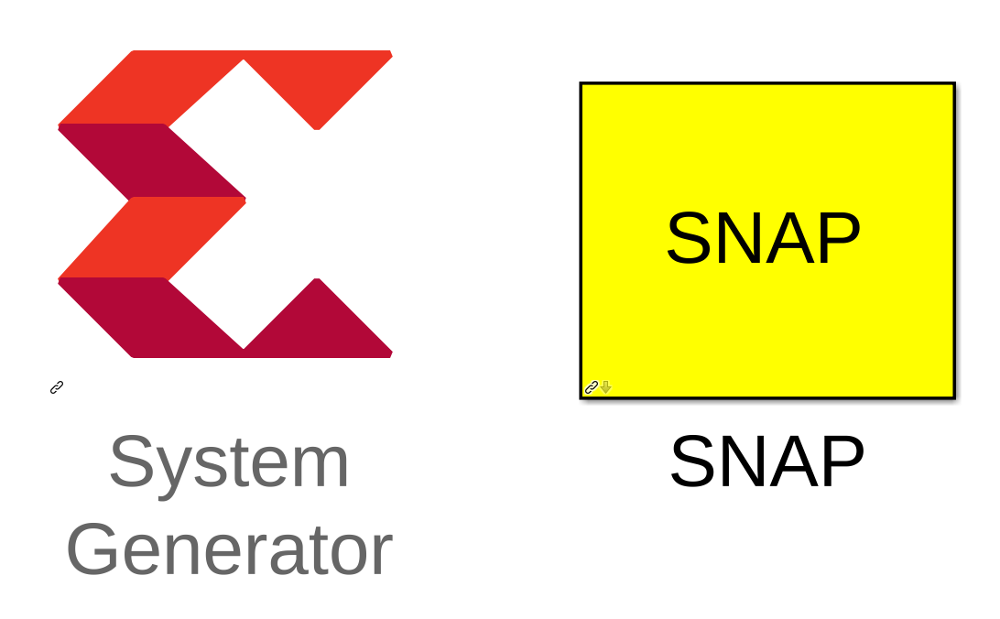
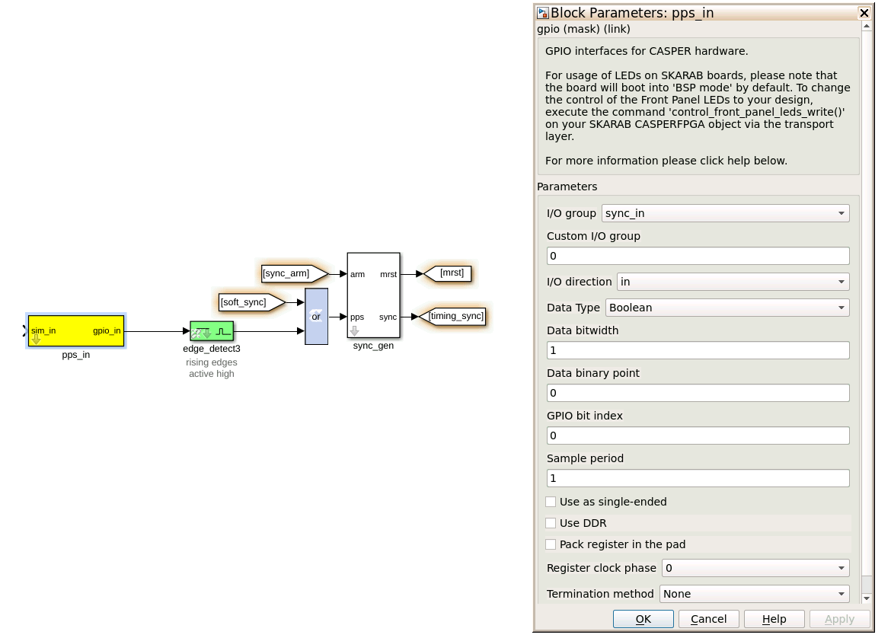
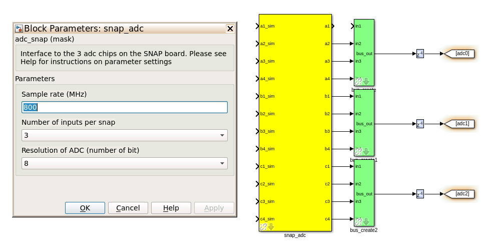
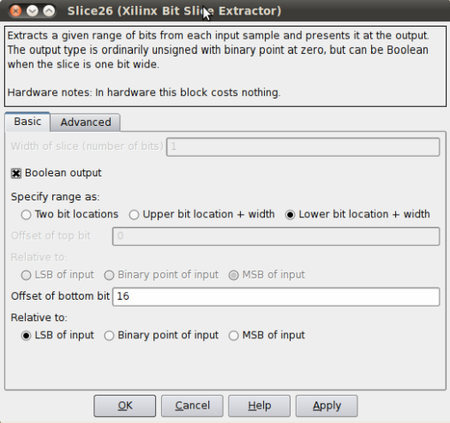
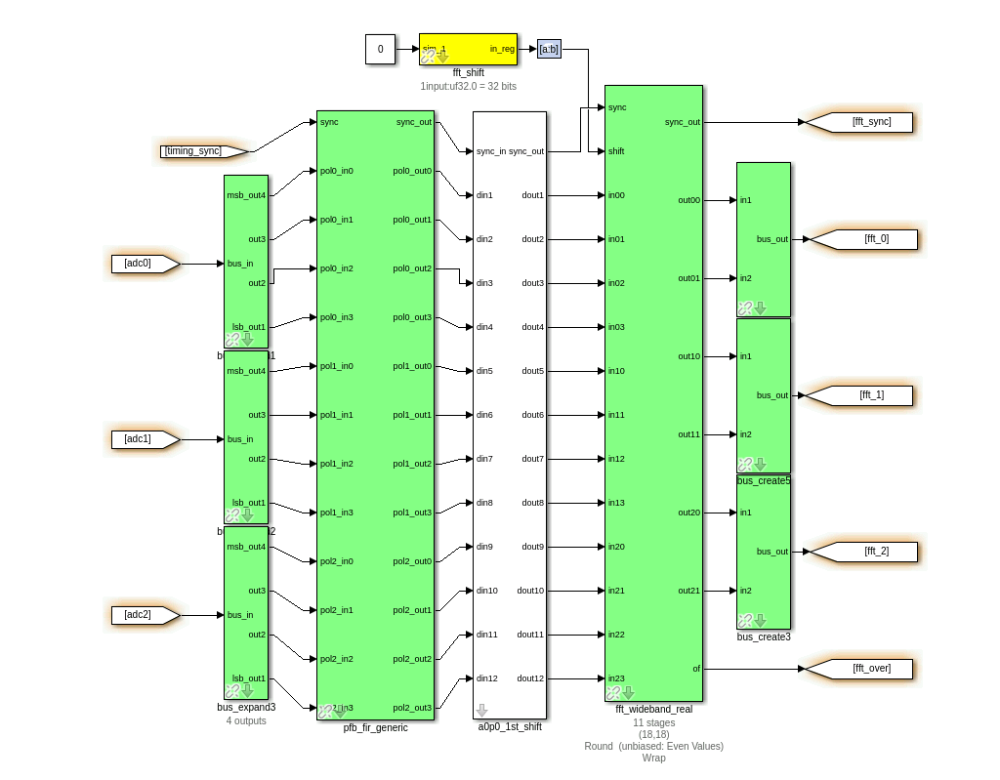
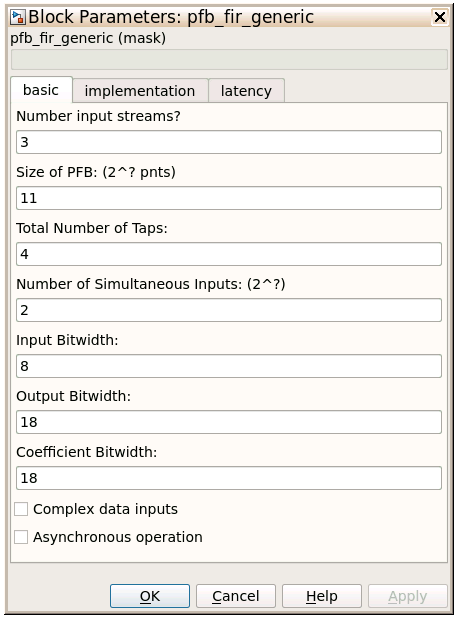
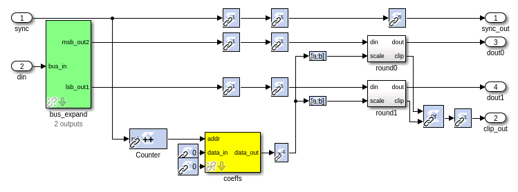
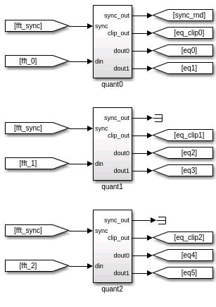
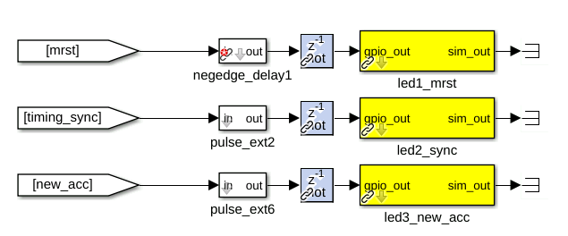
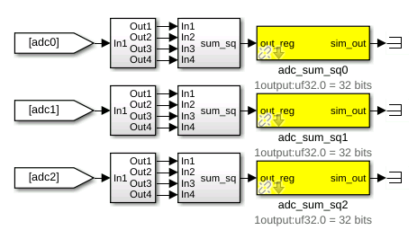

# Tutorial 4: Wideband Pocket Correlator

## Introduction ##
In this tutorial, you will create a simple Simulink design which uses the [iADC](https://casper.berkeley.edu/wiki/ADC2x1000-8) board on [ROACH](https://github.com/casper-astro/casper-hardware/wiki/ROACH2) and the CASPER DSP blockset to process a wideband (400MHz) signal, channelize it and output the visibilities through ROACH's PPC.

By this stage, it is expected that you have completed [tutorial 1](tut_intro.html) and [tutorial 2](tut_ten_gbe.html) and are reasonably comfortable with Simulink and basic Python. We will focus here on higher-level design concepts, and will provide you with low-level detail preimplemented.

## Background ##
Some of this design is similar to that of the previous tutorial, the Wideband Spectrometer. So completion of [tutorial 3](tut_spec.html) is recommended.

### Interferometry ###
In order to improve sensitivity and resolution, telescopes require a large collection area. Instead of using a single, large dish which is expensive to construct and complicated to maneuver, modern radio telescopes use interferometric arrays of smaller dishes (or other antennas). Interferometric arrays allow high resolution to be obtained, whilst still only requiring small individual collecting elements.

### Correlation ###
Interferometric arrays require the relative phases of antennas' signals to be measured. These can then be used to construct an image of the sky. This process is called correlation and involves multiplying signals from all possible antenna pairings in an array. For example, if we have 3 
antennas, A, B and C, we need to perform correlation across each pair, AB, AC and BC. We 
also need to do auto-correlations, which will give us the power in each signal. ie AA, BB, CC. We will 
see this implemented later. The complexity of this calculation scales with the number of antennas squared. Furthermore, it is a difficult signal routing problem since every antenna must be able to exchange data with every other antenna.

### Polarization ###
Dish type receivers are typically dual polarized (horizontal and vertical feeds). Each polarization is fed into separate ADC inputs. When correlating these antennae, we differentiate between full Stokes correlation or a half Stokes method. A full Stokes correlator does cross correlation between the different polarizations (ie for a given two antennas, A and B, it multiplies the horizontal feed from A with the vertical feed from B and vice-versa). A half stokes correlator only correlates like polarizations with each other, thereby halving the compute requirements. 

### The Correlator ###
The correlator we will be designing is a 3 input correlator which uses a SNAP board with each ADC operating in maximum speed mode.

## Creating Your Design ##

### Create a new model ###
Having started Matlab, open Simulink (either by typing simulink on the Matlab command line, or by clicking the Simulink icon in the taskbar). Create a new model and add the Xilinx System Generator and SNAP platform blocks as before in Tutorial 1.

### System Generator and Platform Blocks ###

By now you should have used these blocks a number of times. Pull the <b>System Generator</b> block into your design from the Xilinx Blockset menu under Basic Elements. The settings can be left on default.

The <b>SNAP</b> platform block can be found under the CASPER XPS System Blockset: Platform subsystem. Set the Clock Source to adc0_clk and the rest of the configuration as the default.

### Sync Generator ###

The Sync Generator puts out a sync pulse which is used to synchronize the blocks in the design. See the CASPER memo on sync pulse generation for a detailed explanation.

This sync generator is able to synchronize with an external trigger input. Typically we connect this to a GPS's 1pps output to allow the system to reset on a second boundary after a software arm. This enables us to know precisely the time at which an accumulation was started. It also allows multiple boards to be synchronized which is vital if we are using a signal which correlates digitizers hosted on separate boards.
To synchronize from an external PPS we can drive the sync generator logic with the SNAP's sync_in GPIO input.

Logic is also provided to generate a sync manually via a software input. This allows the design to be used even in the absence of a 1 pps signal. However, in this case, the time the sync pulse occurs depends on the latency of software issuing the sync command and the FPGA signal triggering. This introduces some uncertainty in the timestamps associated with the correlator outputs.

### ADCs ###

Connection of the ADCs is as in tutorial 3 except now we are using all three available inputs.

Throughout this design, we use CASPER's bus_create and bus_expand blocks to simplify routing and make the design easier to follow.

### Control Register ###

This part of the Simulink design sets up a software register which can be configured in software to control the correlator. Set the yellow software register's IO direction as from processor. You can find it in the CASPER_XPS System blockset. The constant block input to this register is used only for simulation.

The output of the software register goes to three slice blocks, which will pull out the individual parameters for use with configuration. The first slice block (top) is setup as follows:

The slice block can be found under the Xilinx Blockset → Control Logic. The only change with the subsequent slice blocks is the Offset of the bottom bit. They are, from top to bottom, respectively,16, 17 & 18.

After each slice block we put an edge_detect block, this outputs true if a boolean input signal is true this clock and was false last clock. Found under CASPER DSP Blockset → Misc.

Next are the delay blocks. They can be left with their default settings and can be found under Xilinx Blockset → Common. The delays used here aren't necessary for the function of the design, but can help meet timing by giving the compiler an extra cycle of latency to use when routing control signals.

The Goto and From bocks can be found under Simulink-> Signal Routing. Label them as in the block diagram above.

### Clip Detect and status reporting ###
To detect and report signal saturation (clipping) to software, we will create a subsystem with latching inputs.

The internals of this subsystem (right) consist of delay blocks, registers and cast blocks.

The delays (inputs 2 - 9) can be keep as default. Cast blocks are required as only unsigned integers can be concatenated. Set their parameters to Unsigned, 1 bit, 0 binary points Truncated Quantization, Wrapped Overflow 
and 0 Latency.

The Registers (inputs 10 - 33) must be set up with an initial value of 0 and with enable and reset ports enabled.
The status register on the output of the clip detect is set to processor in with unsigned data type and 0 binary point with a sample period of 1.

### PFBs, FFTs and Quantisers ###
The PFB FIR, FFT and the Quantizer are the heart of this design, there is one set of each for the 3 ADC channels. However, in order to save resources associated with control logic and PFB and FFT coefficient storage, the independent filters are combined into a single simulink block. This is configured to process three independent data streams by setting the "number of inputs" parameter on the PFB_FIR and FFT blocks to 3.

Configure the PFB_FIR_generic blocks as shown below:

There is potential to overflow the first FFT stage if the input is periodic or signal levels are high as shifting inside the FFT is only performed after each butterfly stage calculation. For this reason, we recommend casting any inputs up to 18 bits with the binary point at position 17 (thus keeping the range of values -1 to 1), and then ownshifting by 1 bit to place the signal in one less than the most significant bits.

The fft_wideband_real block should be configured as follows:

The Quantizer Subsystem is designed as seen below. The quantizer cuts the data signals from the FFT output width (18 bits) down to 4 bits. This means that the downstream processing can be implemented with less resources. In particular, less RAM is needed to store the accumulated correlations.
We have to be careful when quantizing signals to make sure that we're not either saturating the quantizer, or suffering from low signal levels. Prior to quantizing we multiply our signals by a runtime programmable set of coefficients, which can be set so as to ensure the quantizer power output levels are optimal.

The top level view of the Quantizer Subsystem is as seen below. We repeat this system once for each signal path.

### LEDs ###
The following sections are more periphery to the design and will only be touched on. By now you should be comfortable putting the blocks together and be able to figure out many of the values and parameters. The complete design is available in the tutorials repository for reference.

As a debug and monitoring output we can wire up the LEDs to certain signals. We light an LED with every sync pulse. This is a sort of heartbeat showing that the design is clocking and the FPGA is running.

We also use an LED to give a visual indication of when an accumulation is complete.

Since the signals in our design are very low duty cycle, they won't naturally make LED flashes which are visible. We therefore use a pulse extend module to stretch pulses on these signals for 2^24 FPGA clock cycles, which is about 10 ms.

### ADC RMS ###
These blocks calculate the RMS values of the ADCs' input signals. We subsample the input stream by a factor of four and do a pseudo random selection of the parallel inputs to prevent false reporting of repetitive signals. This subsampled stream is squared and accumulated for 2^16 samples.

### The MAC operation ###
The multiply and accumulate is performed in the dir_x (direct-x) blocks, so named because different antenna signal pairs are multiplied directly, in parallel (as opposed to the packetized correlators' X engines which process serially). 

Two sets are used, one for the even channels and another for the odd channels. Accumulation for each antenna pair takes place in BRAM using the same simple vector accumulator used in tut3. 

CONTROL:

The design starts by itself when the FPGA is programmed. The only control register inputs are for resetting counters and optionally sync'ing to external signal.

Sync LED provides a “heartbeat” signal to instantly see if your design is clocked sensibly.

New accumulation LED gives a visual indication of data rates and dump times.

Accumulation counter provides simple mechanism for checking if a new spectrum output is available. (poll and compare to last value)

## Software ##
The python scripts are located in the tut_corr tutorial directory. We first need to run poco_init.py to program the FPGA and configure the design. Then we can run either the auto or the cross correlations plotting scripts (plot_poco_auto.py and plot_poco_cross.py).

Try running these scripts with the -h option to get a description of optional and required arguments.
