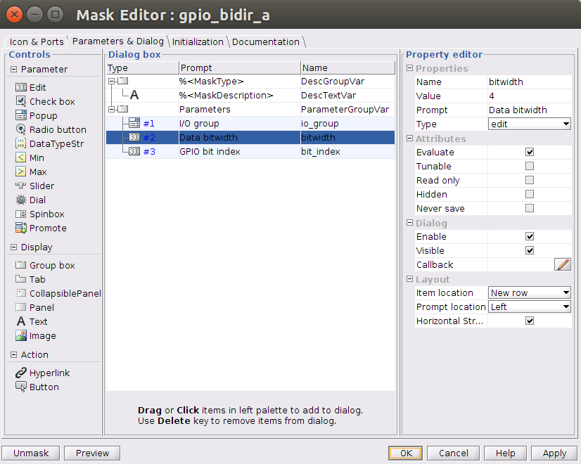
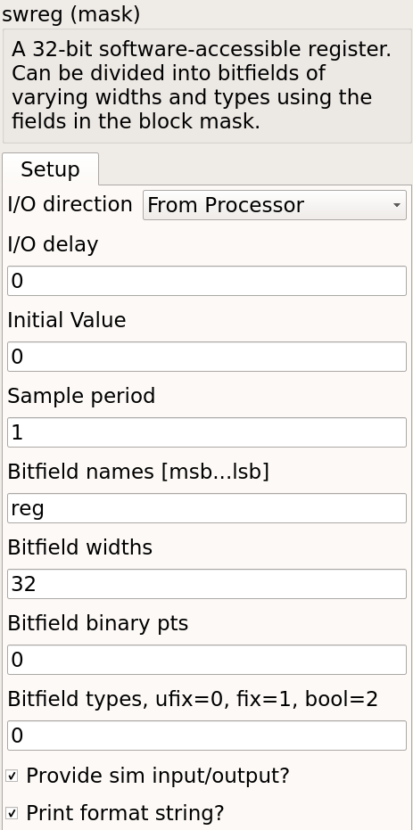
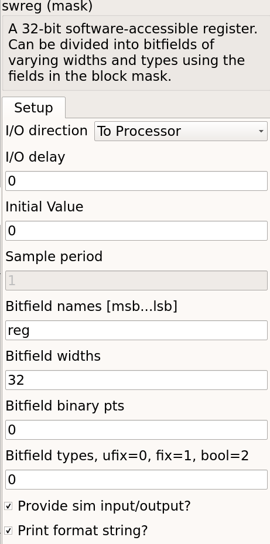
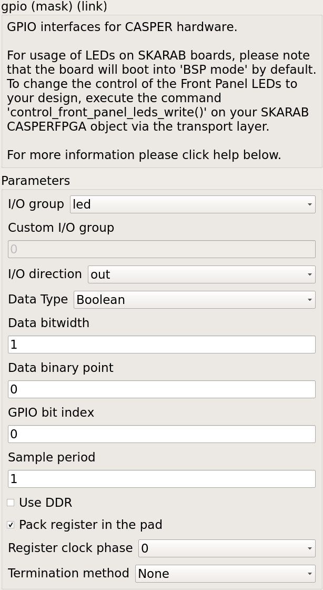
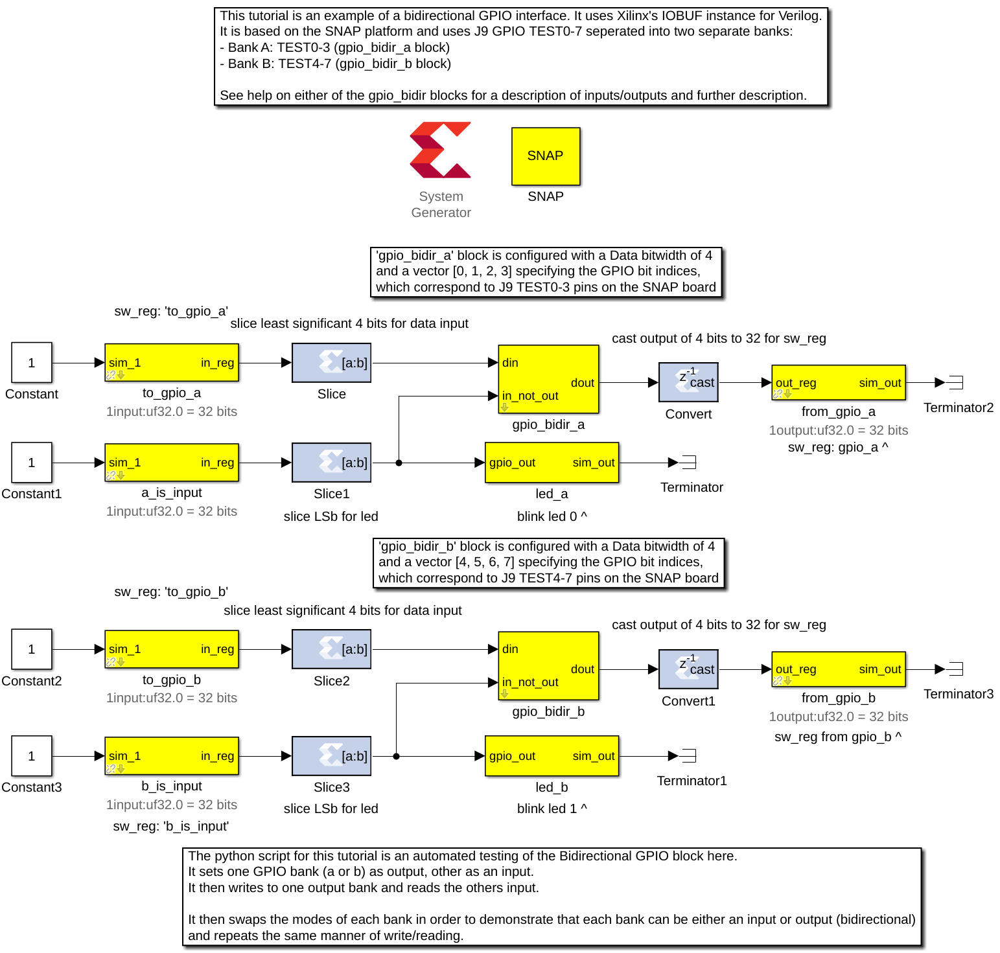

# Yellow Block Tutorial: Bidirectional GPIO
This tutorial aims to provide a very entry level introduction to yellow block creation using the JASPER toolflow. A number of other tutorials and guides already exist. For example, the original [ROACH Yellow Block Tutorial](https://casper.berkeley.edu/wiki/Tutorial_Yellow_Block) in which I based this tutorial from, the [Yellow block EDK wiki page](https://casper.berkeley.edu/wiki/How_to_make_a_%22yellow%22_block), and [Dave George's guide to yellow blocking the KATADC](https://casper.berkeley.edu/wiki/images/8/81/Dg_yellowblock.pdf). This tutorial attempts be more of a guided tour around the inner workings of the toolflow, in which you will make an extremely simple new yellow block.

In this tutorial, you will create a yellow block for a bidirectional GPIO n-bit interface for the SNAP board.

## Making a Bidirectional GPIO - HDL
So we want to design a bidirectional GPIO interface. That means we need to create a bidirectional GPIO module, and convince the toolflow to instantiate it.

(In most cases when we are porting something into the Toolflow, all verilog/vhdl code is completed, tested, and working in the form of a Xilinx Vivado project)

The simplest version of a bidirectional GPIO module that can be created is simply a wrapper around a Xilinx IOBUF instance. An IOBUF (see the 7 series user guide [page 39](https://www.xilinx.com/support/documentation/user_guides/ug471_7Series_SelectIO.pdf)) is a Xilinx module used to connect signals to a bi-directional external pin. It has the following ports, which are described (using slightly loose terminology) below:

I: the input (i.e., from the FPGA to the GPIO pin)

O: the output (i.e., from the GPIO pin to the FPGA)

IO: the GPIO pin (defined by the user in the Simulink mask later)

T: The control signal, which configures the interface as an input (i.e. IO ---> O) when T=1, and an output (i.e. I ---> IO) when T=0.

We construct a module "my_gpio_bidir" which wraps 'n' number such IOBUF instances (i.e., an n-bit wide buffer) and also registers the output signal. This simple module will form the entirety of the interface we will turn into a yellow block. Create a new folder in /mlib_devel/jasper_library/hdl_sources/ named 'my_gpio_bidir' and save your module description as my_gpio_bidir.v there.

NB: n-bit refers to the parameter `WIDTH` below.
```Verilog
module my_gpio_bidir #(parameter WIDTH=1) (
    input            clk,
    inout      [WIDTH-1:0] dio_buf, //inout, NOT input(!)
    input      [WIDTH-1:0] din_i,
    output reg [WIDTH-1:0] dout_o,
    input            in_not_out_i
  );
  
  // A wire for the output data stream
  wire [WIDTH-1:0] dout_wire; 

  // Buffer the in-out data line
  IOBUF iob_data[WIDTH-1:0] (
    .O (dout_wire),  //the data output
    .IO(dio_buf),    //the external in-out signal
    .I(din_i),       //the data input
    .T(in_not_out_i) //The control signal. 1 for input, 0 for output
  ); 
 
  //register the data output
  always @(posedge clk) begin
    dout_o <= dout_wire;
  end
endmodule
```
## Making a Bidirectional GPIO -  Simulink
Start by launching MATLAB via the `./startsg \<your startsg.local file>\`. Create a new Simulink model titled 'tut_gpio_bidir.slx' and save it.

NB: Now is another good time to remind you to save your Simulink model early and save it often! As it is prone to crash at complete random times.

Grab a new yellow block from the XPS library conveniently name 'new_yellow_block'. Rename it 'gpio_bidir_a' as this will serve as our A bank GPIO bidir.

NB: This can be done via the Simulink Library Browser... Or by single clicking anywhere in your model and simply start typing 'new_yellow_block' then pressing enter on the highlighted block shown.

Next, right-click on the yellow block. Navigate to 'Library Link' -> click on 'Disable Link'. Once more, right-click on the yellow block, navigate to 'Library Lock' again, and click 'Break Link'.

Our module has five inputs/outputs. The only ports which need to appear in the yellow block are those that form connections between your module, and the Simulink model. In our case, these are I, O, and T. The clock signal does not come from the Simulink design, but rather some other module. Similarly, the IO signal does not connect to the Simulink model, but rather refers to an external GPIO pin.

Therefore, our yellow block should have 3 ports. An n-bit input (to be connected to I) named 'din', an n-bit output (to be connected to O) named 'dout' and a 1-bit input (to be connected to T) named 'in_not_out'. Be careful -- an input to the yellow block requires a "Gateway out" of simulink, since the signal needs to go out from the Simulink module, in to the new GPIO module. Similarly, an output from the yellow block requires a gateway in, since the signal will go out of the GPIO module and in to the Simulink design.


The names of the ports should match the names used in your module, and gateways out should be preceded by reinterpret and cast blocks to force the correct data types. 

Reinterpret block params:
- Force unsigned arithmetic type
- Force binary point of 0

'din' Convert block params:
- Fixed point, unsigned arithmetic type
- We will take care of the number of bits through the mask, but set binary point to 0
- Truncate and Wrap

'in_not_out' Convert block params:
- Output Type: boolean

Set both Gateway Out blocks to Translate into output port.

Gateway In block params:
- Fixed point, unsigned arithmetic type
- We will take care of the number of bits through the mask, but set binary point to 0
- Truncate and Wrap

Next, you need to tell the toolflow that this is a yellow block, by tagging it as an xps block. Open the block properties(right-click, then select properties), and tag the block by entering xps:\<module_name> in the 'tag' field. In our case the block is tagged 'xps:my_gpio_bidir'.


We are now almost finished with Simulink, except for one last modification to the block. As we have seen, the inputs/outputs of the "Simulink" module take the names of the gateway blocks that define them. In order that these names always be unique, the toolflow mandates that they follow a hierarchical naming scheme. This is defined by: <model_name>_<parent_block_name>_<user_specified_port_name>. Since Simulink ensures that no two blocks have the same name, this naming scheme always results in a unique port name, no matter how many times you instantiate your yellow block. Each yellow block has an initialization script which (amongst other possible functions) must rename gateways in a block according to this convention.

The 'my_gpio_bidir' block's initialization script is 'my_gpio_bidir_mask.m', in the xps_library sub-directory of mlib_devel. It does nothing except find all the gateways in the block (by looking for blocks whose name ends in "<user_specified_port_name>") and renaming them appropriately. As in all things yellow blocky, If in doubt, copy from another block which works and tweak to your needs. :)

``` MATLAB
% find all the gateway in/out blocks
gateway_outs = find_system(gcb, ...
        'searchdepth', 1, ...
        'FollowLinks', 'on', ...
        'lookundermasks', 'all', ...
        'masktype','Xilinx Gateway Out Block'); 

gateway_ins = find_system(gcb, ...
        'searchdepth', 1, ...
        'FollowLinks', 'on', ...
        'lookundermasks', 'all', ...
        'masktype','Xilinx Gateway In Block');
% set number of bits for the Convert block    
convert_blkHandle = getSimulinkBlockHandle([gcb, '/Convert']);
set_param(convert_blkHandle, 'n_bits', num2str(bitwidth));
if length(bit_index) ~= bitwidth
    errordlg('Bit index does not have the same number of elements as the I/O bitwidth. When using bitwidths greater than one, you should specify a vector of bit indices to use.');
end

%rename the gateway outs
for i =1:length(gateway_outs)
    gw = gateway_outs{i};
    gw_name = get_param(gw, 'Name');
    if regexp(gw_name, 'in_not_out_i$')
        set_param(gw, 'Name', clear_name([gcb, '_in_not_out_i']));
    elseif regexp(gw_name, 'din_i$')
        set_param(gw, 'Name', clear_name([gcb, '_din_i']));
    else 
        parent_name = get_param(gw, 'Parent');
        errordlg(['Unknown gateway: ', parent_name, '/', gw_name]);
    end
end 

%rename the gateway ins
for i =1:length(gateway_ins)
    gw = gateway_ins{i};
    gw_name = get_param(gw, 'Name');
    % Set number of bits for gateway in block
    set_param(gw, 'n_bits', num2str(bitwidth));
    if regexp(gw_name, 'dout_o$')
        set_param(gw, 'Name', clear_name([gcb, '_dout_o']));
    else 
        parent_name = get_param(gw, 'Parent');
        errordlg(['Unknown gateway: ', parent_name, '/', gw_name]);
    end
end
```
We call the 'my_gpio_bidir_mask' script by specifiying it in the block's initilization commands in the block mask. I.e., right click the block, create a mask, and add to the initialization section `my_gpio_bidir_mask;`. This is exactly the same as the procedure used to call drawing functions for any other (non-yellow) library blocks.

Next, we need to add some parameters. Click on the 'Parameters & Dialog' tab, and click-and-drag a popup box over from the left hand side under the 'Parameters' folder. Repeat by adding two edit boxes to the parameters folder.

The configurations are as follows:

 

Set the 'Type options' parameter for 'iogroup' by clicking on the pencil next to 'Popup options' to (should match the options in the same popup for the GPIO block):
```
led
gpio
sync_in
sync_out
zdok0
zdok1
```

 

Next, we continue by referring to the picture below. You should copy and paste the 'gpio_bidir_a' block and rename it as 'gpio_bidir_b', this second block will be used for B bank GPIO's. Be sure to set the I/O group and Data bitwidth for both my_gpio_bidir blocks to 'gpio' and 4. Set the GPIO bit index for gpio_bidir_a to the Matlab vector '[0, 1, 2, 3]' and for gpio_bidir_b to the Matlab vector '[4, 5, 6, 7]'. The length of these vectors must match the value entered for Data bitwidth.

Following, drop in 4 software register blocks, named 'to_gpio_a', 'a_is_input', 'to_gpio_b', and 'b_is_input'. All with the same parameters shown below:



Additionally, drop in 2 more software register blocks named '' and ''. Both with the following parameters:



Finally, insert 2 gpio blocks that will be configured as leds. The first with a 'GPIO bit index' of '0' and the second as '1':



Below is a top-level view of the whole-finished Simulink Model (if you are having any difficulties a completed Simulink model can be found [here](https://github.com/casper-astro/tutorials_devel/blob/master/vivado/snap/tut_gpio_bidir/tut_gpio_bidir.slx)):




## Am I on the right track?
To ensure we are on the right track, we will run the 'jasper' command in the Matlab terminal and check to see if our yellow blocks ended up in jasper.per file. This file contains all the peripherals from our Simulink model.

NB: This script will fail because we have not written the proper Python yellow block code yet. This is just to double-check on the right track.

When the script fails, open up the build directory (named the same as your simulink model) and open the file 'jasper.per' Read through it and ensure you find your new yellow blocks in it (search for the name of your yellow block). If you don't then something went wrong, and you should re-read this tutorial to see where you differed. If you see the yellow block, please continue on.

## Python auto-gen scripts (JASPER Toolflow)
Now we have the module (HDL you wrote first) and Simulink model finished. It is time to write some Python code so that the toolflow will see our yellow block and instantiate the module. When the toolflow runs, it will look for xps-tagged blocks in your design. For each one it will construct an instantiation, connecting your yellow block ports/parameters to the HDL code you wrote. This will all later show up in a top-level auto-generated entity, cleverly called 'top.v'.

The toolflow is as follows, starting with the jasper command in the matlab terminal (all scripts can be found in the mlib_devel directory or yellow_block sub-dir):

jasper.m -> jasper_frontend.m -> exec_flow.py -> toolflow.py -> yellow_block.py -> my_gpio_bidir.py

The last script will be the name of your module as in this case `my_gpio_bidir.py`. Create this script in the yellow block sub-directory of mlib_devel. I recommend carefully reading yellow_block.py as the function header comments are well written and explain what you need to do. :)

NB: I figured out how to create this script by comparing my_gpio_bidir to the gpio yellow block. First I found the hdl_source file for it. Next I compared the top.v from a different project that contained the gpio block (as top.v contains the instantiation for the gpio module) Then, I compared the script that generated that instantiation (gpio.py) to the top.v and hdl source. 

Start by first just tweaking the modify_top function to suit your needs, run 'jasper' command and fix python errors until the errors point to the gen_constaints function. Next, repeat the process for the gen_constraints function. Debug and repeat until you compile w/out errors, look in top.v file in the build directory and you should see your yellow block instantiation. Carefully add the rest of your functionality from here until your top.v instantiation matches your HDL code (module).

(Move on to the next section, once the 'jasper' command finishes and your yellow block instantiation matches the module)

The code for the my_gpio_bidir yellow block is below (pay particular attention to the comments):
```Python
from yellow_block import YellowBlock
from constraints import PortConstraint
from helpers import to_int_list

class my_gpio_bidir(YellowBlock):
    def initialize(self):
        # Set bitwidth of block (this is determined by the 'Data bitwidth' parameter in the Simulink mask)
        self.bitwidth = int(self.bitwidth)
        # add the source files, which have the same name as the module (this is the verilog module created above)
        self.module = 'my_gpio_bidir'
        self.add_source(self.module)

    def modify_top(self,top):
        # port name to be used for 'dio_buf'
        external_port_name = self.fullname + '_ext'
        # get this instance from 'top.v' or create if not instantiated yet
        inst = top.get_instance(entity=self.module, name=self.fullname, comment=self.fullname)
        # add ports necessary for instantiation of module
        inst.add_port('clk', signal='user_clk', parent_sig=False)
        # parent_port=True, and dir='input', so add an input to 'top.v'
        inst.add_port('dio_buf', signal=external_port_name, dir='inout', width=self.bitwidth, parent_port=True)
        inst.add_port('din_i', signal='%s_din_i'%self.fullname, width=self.bitwidth)
        inst.add_port('dout_o', signal='%s_dout_o'%self.fullname, width=self.bitwidth)
        inst.add_port('in_not_out_i', signal='%s_in_not_out_i'%self.fullname)
        # add width parameter from 'Data bitwidth' parameter in Simulink mask
        inst.add_parameter('WIDTH', str(self.bitwidth))

    def gen_constraints(self):
        # add port constraint to user_const.xdc for 'inout' ()
        return [PortConstraint(self.fullname+'_ext', self.io_group, port_index=range(self.bitwidth), iogroup_index=to_int_list(self.bit_index))]
```
## Testing
Now we need to test. The python script for this tutorial is an automated testing of the Bidirectional GPIO block we just made. It sets one GPIO bank (a or b) as output, the other as an input. It then writes to one output bank and reads the others input. After which it swaps the modes of each bank in order to demonstrate that each bank can be either an input or output (bidirectional) and repeats the same manner of write/reading.

Run the script included below in the terminal using the command:
```
./tut_gpio_bidir.py -f <Generated fpg file here> <SNAP hostname or ip addr>
```
NB: You may need to run ```chmod +x ./tut_gpio_bidir.py``` first.
```Python
#!/usr/bin/env python
'''
Script for testing the Bi-Directional GPIO Yellow Block created for CASPER Tutorial 7.
Author: Tyrone van Balla, January 2016
Reworked for SNAP and tested: Brian Bradford, May 2018
'''
import casperfpga
import time
import sys
import numpy as np

fpgfile = 'tut_gpio_bidir.fpg'
fpgas = []

def exit_clean():
    try:
        for f in fpgas: f.stop()
    except:
        pass
    exit()

def exit_fail():
    print 'FAILURE DETECTED. Exiting . . .'
    exit()

if __name__ == '__main__':
    import argparse

    parser = argparse.ArgumentParser()
    parser.add_argument("snap", help="<SNAP_HOSTNAME or IP>")
    parser.add_argument("-f", "--fpgfile", type=str, default=fpgfile, help="Specify the fpg file to load")
    parser.add_argument("-i", "--ipython", action='store_true', help="Enable iPython control")

    args = parser.parse_args()

    if args.snap == "":
        print 'Please specify a SNAP board. \nExiting'
        exit()
    else:
        snap = args.snap

    if args.fpgfile != '':
        fpgfile = args.fpgfile

# try:

print "Connecting to server %s . . . "%(snap),
fpga = casperfpga.CasperFpga(snap)
time.sleep(1)

if fpga.is_connected():
    print 'ok\n'
else:
    print 'ERROR connecting to server %s . . .'%(snap)
    exit_fail()

# program fpga with bitstream

print '------------------------'
print 'Programming FPGA...',
sys.stdout.flush()
fpga.upload_to_ram_and_program(fpgfile)
time.sleep(1)
print 'ok'

# intialize gpio bank control registers
fpga.write_int('a_is_input', 1)
fpga.write_int('b_is_input', 1)

if args.ipython:
    # open ipython session for manual testing of yellow block
    
    # list all registers first
    print '\nAvailable Registers:'
    registers = fpga.listdev()
    for reg in registers:
        if not('sys' in reg):
            print '\t',
            print reg
        else:
            pass
    print '\n'

    # how to use
    print 'Use "fpga" as the fpga object\n'

    import IPython; IPython.embed()
    
    print 'Exiting . . .'
    exit_clean()

'''
Automated testing of Bidirectional GPIO Block.
Sets one GPIO bank as output, other as input.
Writes to output bank, reads input.

Swaps mode of banks to demonstrate either bank can be either input or output.

'''
print '#################################'
# Send from GPIO_LED (B) to GPIO_GPIO (A) 
print '\nConfiguring to send from GPIO_LED (B) to GPIO_GPIO (A)\n'
fpga.write_int('a_is_input', 1) # GPIO_GPIO as input
fpga.write_int('b_is_input', 0) # GPIO_LED as output

print 'Initial Values: A: %s, B: %s\n' % (np.binary_repr(fpga.read_int('from_gpio_a'), width=4), np.binary_repr(fpga.read_int('from_gpio_b'), width=4))
print 'Writing 0xF to B . . . \n'

fpga.write_int('to_gpio_a', 0)  # dummy data written to GPIO_GPIO
fpga.write_int('to_gpio_b', 0xFFFF) # data written to GPIO_LED
time.sleep(0.01)

print 'A: 0 <------------- B: 0xF\n'

from_a = fpga.read_int('from_gpio_a') # read GPIO_GPIO
from_b = fpga.read_int('from_gpio_b') # read GPIO_LED

print 'Readback values: A: %s, B: %s\n' % (np.binary_repr(from_a, width=4), np.binary_repr(from_b, width=4))

print 'Writing 0x0 to B . . . \n'
print 'A: 0xF <---------- B: 0x0\n'

fpga.write_int('to_gpio_a', 0xFFFF) # dummy data written to GPIO_GPIO
fpga.write_int('to_gpio_b', 0x0) # data written to GPIO_LED
time.sleep(0.01)

from_a = fpga.read_int('from_gpio_a') # read GPIO_GPIO
from_b = fpga.read_int('from_gpio_b') # read GPIO_LED

print 'Readback values: A: %s, B: %s\n' % (np.binary_repr(from_a, width=4), np.binary_repr(from_b, width=4))

print '##################################'
# Send from GPIO_GPIO  (A) to GPIO_LED (B) 
print '\nConfiguring to send from GPIO_GPIO (A) to GPIO_LED (B)\n'
fpga.write_int('a_is_input', 0) # GPIO_GPIO as output
fpga.write_int('b_is_input', 1) # GPIO_LED as input

print 'Initial Values: A: %s, B: %s\n' % (np.binary_repr(fpga.read_int('from_gpio_a'), width=4), np.binary_repr(fpga.read_int('from_gpio_b'), width=4))
print 'Writing 0x0 to A . . . \n'

fpga.write_int('to_gpio_a', 0)  # data written to GPIO_GPIO
fpga.write_int('to_gpio_b', 0xFFFF) # dummy data written to GPIO_LED
time.sleep(0.01)

print 'A: 0 -------------> B: 0xF\n'

from_a = fpga.read_int('from_gpio_a') # read GPIO_GPIO
from_b = fpga.read_int('from_gpio_b') # read GPIO_LED

print 'Readback values: A: %s, B: %s\n' % (np.binary_repr(from_a, width=4), np.binary_repr(from_b, width=4))

print 'Writing 0xF to A . . . \n'

print 'A: 0xF ----------> B: 0x0\n'

fpga.write_int('to_gpio_a', 0xFFFF) # data written to GPIO_GPIO
fpga.write_int('to_gpio_b', 0x0) # dummy data written to GPIO_LED
time.sleep(0.01)

from_a = fpga.read_int('from_gpio_a') # read GPIO_GPIO
from_b = fpga.read_int('from_gpio_b') # read GPIO_LED

print 'Readback values: A: %s, B: %s\n' % (np.binary_repr(from_a, width=4), np.binary_repr(from_b, width=4))

# except KeyboardInterrupt:
#     exit_clean()
# except Exception as inst:
#     exit_fail()

exit_clean()
```

Your results without wiring pins on the SNAP board should look something close to:
```
Connecting to server rpi2-11 . . .  ok

------------------------
Programming FPGA... ok
#################################

Configuring to send from GPIO_LED (B) to GPIO_GPIO (A)

Initial Values: A: 0000, B: 0000

Writing 0xF to B . . . 

A: 0 <------------- B: 0xF

Readback values: A: 0000, B: 1111

Writing 0x0 to B . . . 

A: 0xF <---------- B: 0x0

Readback values: A: 1111, B: 0000

##################################

Configuring to send from GPIO_GPIO (A) to GPIO_LED (B)

Initial Values: A: 1111, B: 0000

Writing 0x0 to A . . . 

A: 0 -------------> B: 0xF

Readback values: A: 0000, B: 0000

Writing 0xF to A . . . 

A: 0xF ----------> B: 0x0

Readback values: A: 1111, B: 1111
```
Now we will wire up the pins on the SNAP board correctly. Put the following female jumpers between pins on the J9 GPIO (refer to page 14 of [SNAP Schematic](https://casper.berkeley.edu/wiki/images/8/8e/DAB-HERALD_Schematic_revC.pdf) if necessary):
- TEST0 and TEST4
- TEST1 and TEST5
- TEST2 and TEST6
- TEST3 and TEST7

After this, run the same script again.
The expected results are:
```
Connecting to server rpi2-11 . . .  ok

------------------------
Programming FPGA... ok
#################################

Configuring to send from GPIO_LED (B) to GPIO_GPIO (A)

Initial Values: A: 0000, B: 0000

Writing 0xF to B . . . 

A: 0 <------------- B: 0xF

Readback values: A: 1111, B: 1111

Writing 0x0 to B . . . 

A: 0xF <---------- B: 0x0

Readback values: A: 0000, B: 0000

##################################

Configuring to send from GPIO_GPIO (A) to GPIO_LED (B)

Initial Values: A: 1111, B: 1111

Writing 0x0 to A . . . 

A: 0 -------------> B: 0xF

Readback values: A: 0000, B: 0000

Writing 0xF to A . . . 

A: 0xF ----------> B: 0x0

Readback values: A: 1111, B: 1111
```
If you matched the result above, then congratulations you've successfully created and tested your first yellow block! 

If not, start by ensuring your original HDL code was correct to begin with, then debug the yellow block Python script you wrote.

## Add yellow block to XPS Library
1. Create a new Simulink model with the name identical to your yellow block name (rename your yellow block if it is an unacceptable model name)
2. Add your yellow block to the model. (This should be the only block in the model)
3. Add your yellow block mask script to 'xps_library' folder if needed.
4. Save your Simulink model in the 'xps_models' folder (please put it in the directory that makes sense, otherwise create a new directory)
5. Launch Matlab via the `./startsg` script in mlib_devel directory.
6. Double-click on 'xps_library' directory from the 'Current Folder' pane on the left-hand side of the Matlab window.
7. Run `xps_build_new_library`, click 'Yes' on overwrite dialog prompt and ignore any warnings.
8. For any models you wish to link with this new library, open the model and run `update_casper_blocks(bdroot)` in the Matlab command window. (Preferably all your models)

**Now help out CASPER by adding more yellow blocks to our library :)**

---
**Author: [Brian Bradford](https://github.com/bjbford), June 1, 2018**

**Credit to [Jack Hickish](https://github.com/jack-h) for [original ROACH yellow block tutorial](https://casper.berkeley.edu/wiki/Tutorial_Yellow_Block), in which I based this from.**