# Introduction Tutorial
In this tutorial, you will create a simple Simulink design using both standard Xilinx system generator blockset, as well as library blocks specific to CASPER boards (so-called "Yellow Blocks"). At the end of this tutorial, you will know how to generate an fpg file, program it to a CASPER FPGA board, and interact with your running hardware design using [casperfpga](https://github.com/casper-astro/casperfpga) via a Python Interface.

## Setup
The lab at the workshop is pre-configured with the CASPER libraries, MATLAB and Xilinx tools. See [here](https://casper.berkeley.edu/wiki/Casper_Caltech_Workshop_2017_Tutorials_Help_Page) for information about the local set up.

## Creating Your Design
### Create a New Model
Start Matlab via executing the <code>startsg</code> command, as described [here](https://casper.berkeley.edu/wiki/Casper_Caltech_Workshop_2017_Tutorials_Help_Page). This ensures that necessary Xilinx and CASPER libraries are loaded into your by Simulink. When MATLAB starts up, open Simulink by typing <i>simulink</i> on the MATLAB command line. Start a new model, and save it with an appropriate name. **With Simulink, it is very wise to save early, and often**.

There are some Matlab limitations you should be aware-of right from the start:
 
**Do not use spaces in your filenames** or anywhere in the file path as it will break the toolflow.
**Do not use capital letters in your filenames** or anywhere in the file path as it will break the toolflow.
**Beware block paths that exceed 64 characters**. This refers to not only the file path, but also the path to any block within your design. For example, if you save a model file with a name ~/some_really_long_filename.slx, and have a block called <block> in a submodule <submodule> the longest block path would be: some_really_long_filename_submodule_block. If you use lots of subsystems, this can cause problems. 

### Library organization
There are three libraries which you will use when you design firmware in Simulink.
1. The *CASPER XPS Library* contains "Yellow Blocks" -- these are blocks which encapsulate interfaces to hardware (ADCs, Memory chips, CPUs, Ethernet ports, etc.) 
2. The *CASPER DSP Library* contains (mostly green) blocks which inplement DSP functions, like filters, FFTs, etc.
3. The *Xilinx Library* contains blue blocks which provide low-level functionality such as multiplexing, delaying, adding, etc. The Xilinx library also contains the super-special System Generator block, which contains information about the type of FPGA you are targeting.

### Add Xilinx System Generator and XSG core config blocks
Add a System generator block from the Xilinx library by locating the <i>Xilinx Blockset</i> library's <i>Basic Elements</i> subsection and dragging a <i>System Generator</i> token onto your new file. 

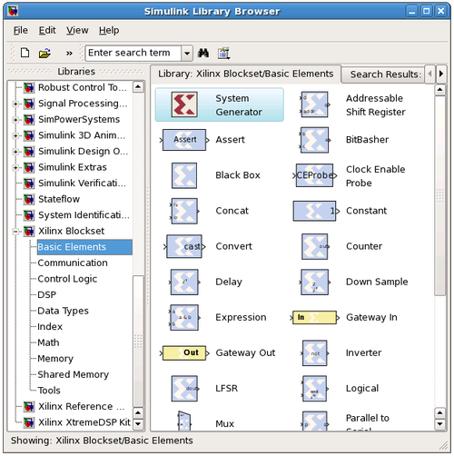

Do not configure it directly, but rather add a platform block representing the system you care compiling for. These can be found in the <i>CASPER XPS System Blockset</i> library. For SNAP (and later) platforms, you need a block which matches the platform name, which can be found in the library under "platforms", as shown below.

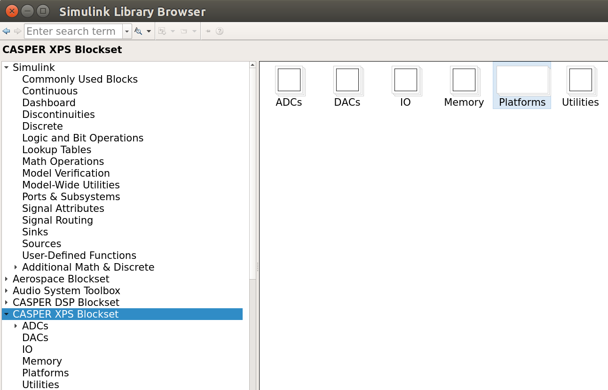

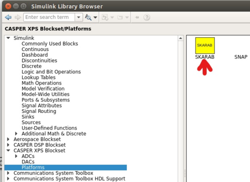


Double click on the platform block that you just added. The <i>Hardware Platform</i> parameter should match the platform you are compiling for. Once you have selected a board, you need to choose where it will get its clock. In designs including ADCs you probably want the FPGA clock to be derived from the sampling clock, but for this simple design (which doesn't include an ADC) you should use the platform's on-board clock. To do this, set the <i>User IP Clock Source</i> to <b>sys_clk</b>. The sys_clk rate is 100 MHz, so you should set this for *User IP Clock Rate* in the block.

The configuration yellow block knows what FPGA corresponds to which platform, and so it will autmoatically configure the System Generator block which you previously added.

**The System Generator and XPS Config blocks are required by all CASPER designs**


### Flashing LED
To demonstrate the basic use of hardware interfaces, we will make an LED flash. With the FPGA running at ~100MHz (or greater), the most significant bit (msb) of a 27 bit counter will toggle approximately every 0.67 seconds. We can output this bit to an LED on your board. Most (all?) CASPER platforms have at least four LEDs, with the exact configuration depending on the board. We will make a small circuit connecting the top bit of a 27 bit counter to one of these LEDs. When compiled this will make the LED flash with a 50% duty cycle approximately once a second.

#### Add a counter
Add a counter to your design by navigating to Xilinx Blockset -> Basic Elements -> Counter and dragging it onto your model.

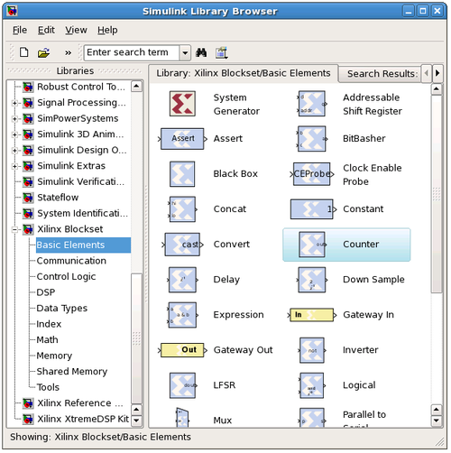

Double-click it and set it for free running, 27 bits, unsigned. This means it will count from 0 to 2^27 - 1, and will then wrap back to zero and continue.

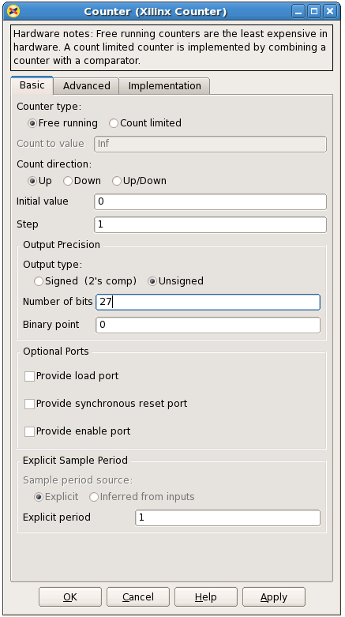

#### Add a slice block to select out the msb
We now need to select the [most significant bit](http://en.wikipedia.org/wiki/Most_significant_bit) (msb) of the counter. We do this using a slice block, which Xilinx provides. Xilinx Blockset -> Basic Elements -> Slice.

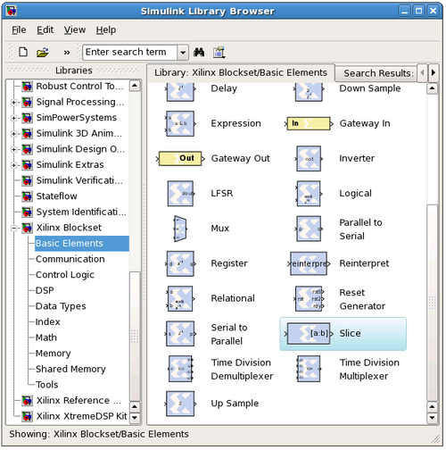

Double-click on the newly added slice block. There are multiple ways to select which bit(s) you want.  In this case, it is simplest to index from the upper end and select the first bit. If you wanted the [least significant bit](http://en.wikipedia.org/wiki/Least_significant_bit) (lsb), you can also index from that position. You can either select the width and offset, or two bit locations.

Set it for 1 bit wide with offset from top bit at zero. As you might guess, this will take the 27-bit input signal, and output just the top bit.

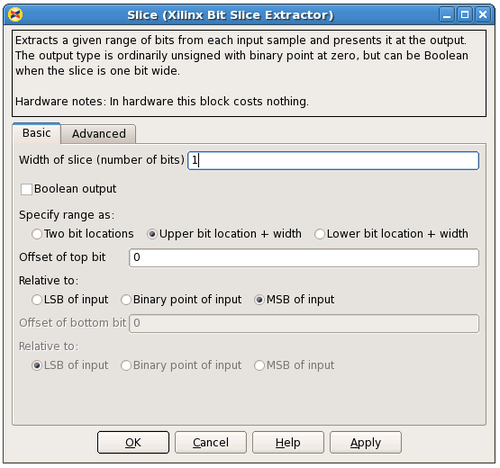

#### Add a GPIO block
From: CASPER XPS library -> gpio.

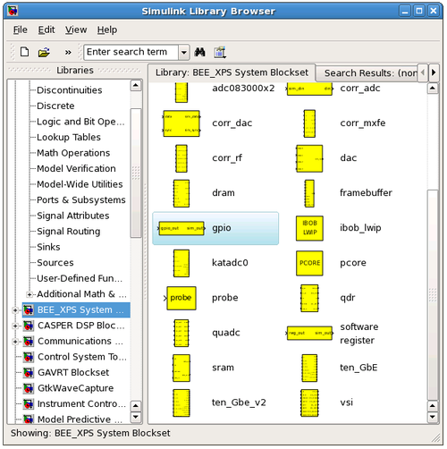

In order to send the 1 bit signal you have sliced off to an LED, you need to connect it to the right FPGA output pin. To do this you can use a GPIO (general-purpose input/output) block from the XPS library, this allows you to route a signal from Simulink to a selection of FPGA pins, which are addressed with user-friendly names. Set it to use SNAP's LED bank as output. Once you've chosen the LED bank, you need to pick *which* LED you want to output to. Set the GPIO bit index to 0 (the first LED) and the data type to Boolean with bitwidth 1. This means your simulink input is a 1 bit Boolean, and the output is LED0.

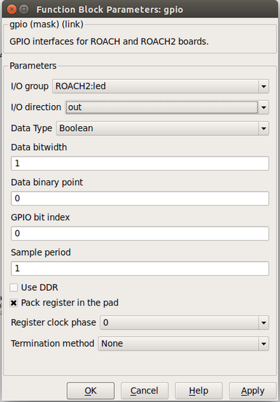

#### Add a terminator
To prevent warnings (from MATLAB & Simulink) about unconnected outputs, terminate all unused outputs using a *Terminator*:


From: Simulink -> Sinks -> Terminator

You can also use the Matlab function XlAddTerms, run in the MATLAB prompt, to automatically terminate your unused outputs.

#### Connect your design
It is a good idea to rename your blocks to something more sensible, like counter_led instead of just counter. Do this simply by double-clicking on the name of the block and editing the text appropriately.

To connect the blocks simply click and drag from the 'output arrow' on one block and drag it to the 'input arrow' of another block. Connect the blocks together: Counter -> Slice -> gpio as showing in digram below.


Remember to save your design often. 

#### Software control
To demonstrate the use of software registers to control the FPGA from a computer, we will add a registers so that the counter in our design can be started, stopped, and reset from software. We will also add a register so that we can monitor the counter's current value too.

By the end of this section, you will create a system that looks like this:


#### Add the software registers ###
We need two software registers. One to control the counter, and a second one to read its current value. From the CASPER XPS System Blockset library, drag two Software Registers onto your design.

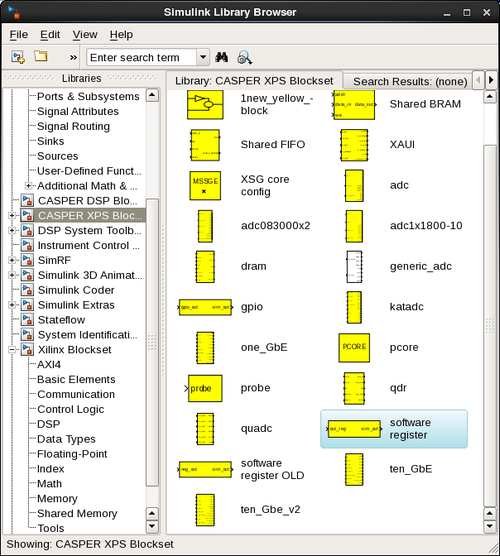

Set the I/O direction to *From Processor* on the first one (counter control) to enable a value to be set from software and sent *to* your FPGA design. Set it to *To Processor* on the second one (counter value) to enable a value to be sent *from* the FPGA to software. Set both registers to a bitwidth of 32 bits.

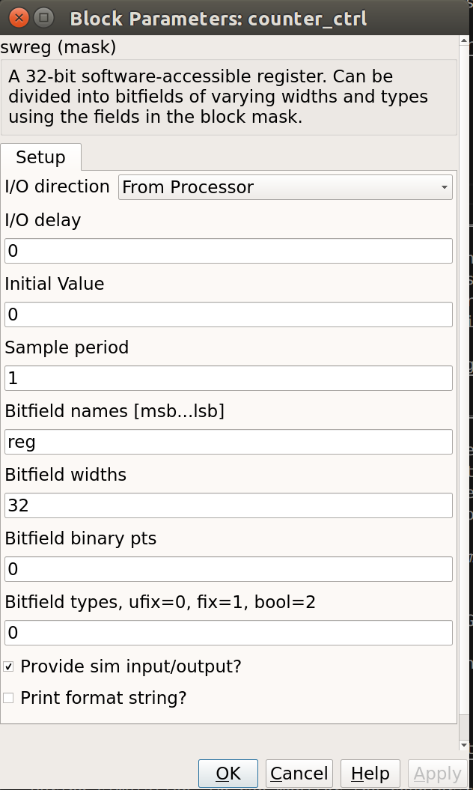

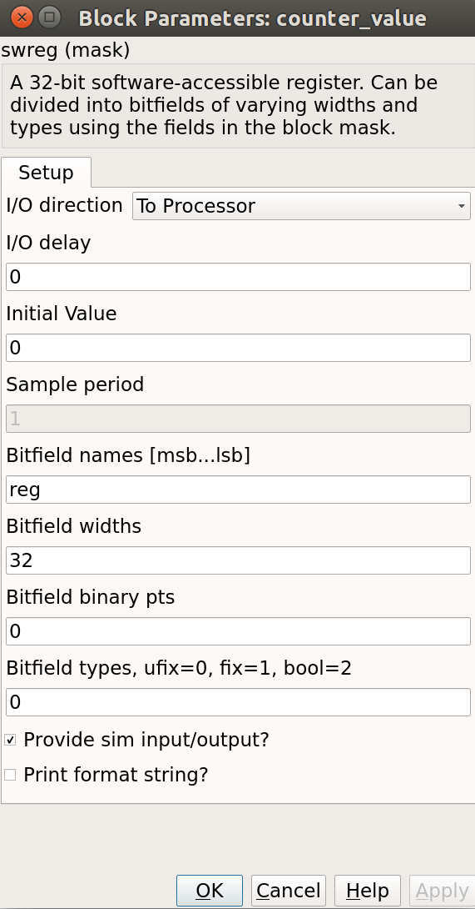

Rename the registers to something sensible. The names you give them here are the names you will use to access them from software. Do not use spaces, slashes and other funny characters in these. Perhaps *counter_ctrl* and *counter_value*, to represent the control and output registers respectively.

Also note that the software registers have *sim_reg* and *sim_out* ports. The input port provides a means of simulating this register's value (as would be set by the runtime software) using the sim_reg line. The output port provides a means to simulate this register's current FPGA-assigned value.

For now, set the <i>sim_reg</i> port to constant one using a Simulink-type constant. Found in *Simulink -> Sources*. This will enable the counter during simulations.

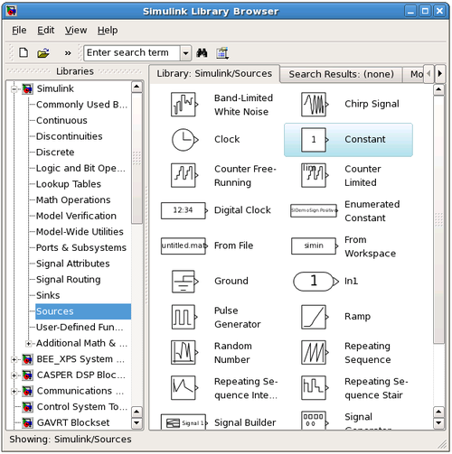

During simulation, we can monitor the counter's value using a scope (*Simulink -> Sinks*):


Here is a good point to note that all blocks from the *Simulink* library (usually white), will not be compiled into hardware. They are present for simulation only.

Only Xilinx blocks (they are blue with Xilinx logo) will be compiled to hardware.

You need to use *gateway* blocks whenever connecting a Simulink-provided block (like a scope or sine-wave generator) to a from a Xilinx block, this will sample and quantize the simulink signals so that they are compatible with the Xilinx world. Some blocks (like the software register) provide a gateway internally, so you can feed the input of a software register with a xilinx signal, and monitor its output with a Simulink scope. However, in general, you must manually insert these gateways where appropriate. Simulink will issue warnings for any direct connections between the Simulink and Xilinx worlds.


#### Add the counter
You can do this either by copying your existing counter block (copy-paste, or ctrl-click-drag-drop) or by placing a new one from the library.

Configure it with a reset and enable port as follows:


#### Add the slice blocks
Now we need some way to control the enable and reset ports of the counter. We could do this using two separate software registers, but this is wasteful since each register is 32 bits anyway.

So we'll use a single register and slice out one bit for enabling the counter, and another bit for resetting it. Either copy your existing slice block (copy-paste it or hold ctrl while dragging/dropping it) or add two more from the library.

The enable and reset ports of the counter require boolean values (which Simulink interprets differently from ordinary 1-bit unsigned numbers). Configure the slices as follows:

Slice for enable:


Slice for reset:

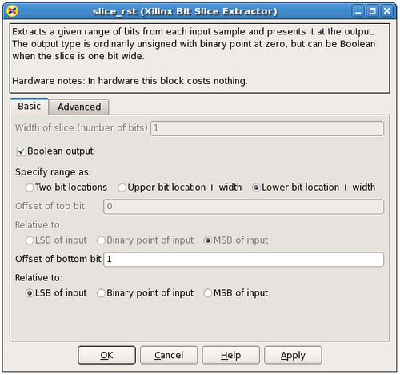

#### Connect it all up
Now we need to connect all these blocks together. To neaten things up, consider resizing the slice blocks and hiding their names. Their function is clear enough from their icon without needing to see their names.

Do so by right-clicking and unchecking Format → Show Block Name. You could do this with the counter too, but it's not a good idea with the software registers, because otherwise you wouldn't know how to address them when looking at your diagram.

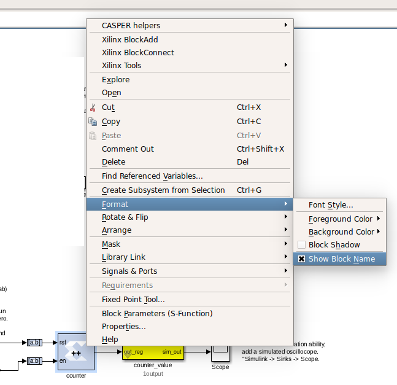

### Adder
To demonstrate some simple mathematical operations, we will create an adder. It will add two numbers on demand and output the result to another software register. Almost all astronomy DSP is done using fixed-point (integer) notation, and this adder will be no different.

We will calculate a+b#sum_a_b.


#### Add the software registers
Add two more input software registers. These will allow us to specify the two numbers to add. Add another output register for the sum output.

Either copy your existing software register blocks (copy-paste or holding ctrl while dragging/dropping it) or add three more from the library.  Set the I/O direction to From Processor on the first two and set it to To Processor on the third one.

#### Add the adder block
Locate the adder/subtractor block, Xilinx Blockset -> Math -> AddSub and drag one onto your design. This block can optionally perform addition or subtraction. Let's leave it set at it's default, for addition.

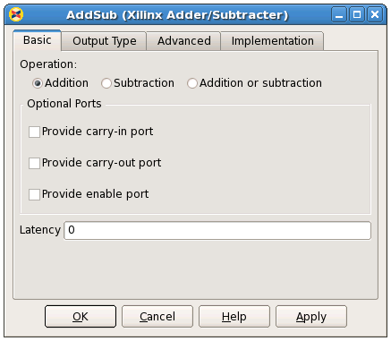

The output register is 32 bits. If we add two 32 bit numbers, we will have 33 bits.

There are a number of ways of fixing this:

* limit the input bitwidth(s) with slice blocks
* limit the output bitwidth with slice blocks
* create a 32 bit adder.

Since you have already seen slice blocks demonstrated, let's try to set the AddSub block to
be a 32 bit saturating adder. On the second tab, set it for user-defined precision, unsigned 32 bits.

Also, under overflow, set it to saturate. Now if we add two very large numbers, it will simply return 2^32 -1.

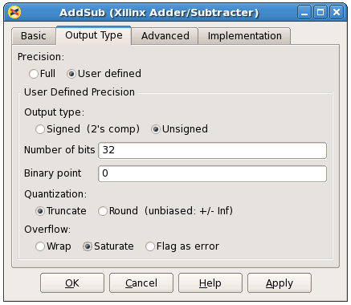

#### Add the scope and simulation inputs
Either copy your existing scope and simulation constants (copy-paste or ctrl-drag) or place a new one from the library as before. Set the values of the simulation inputs to anything you like.

#### Connect it all together
Like this:


## Simulating
The design can be simulated with clock-for-clock accuracy directly from within Simulink. Set the number of clock cycles that you'd like to simulate and press the play button in the top toolbar.


You can watch the simulation progress in the status bar in the bottom right. It will complete in the blink of an eye for this small design with just 10 clock cycles.

You can double-click on the scopes to see what the signals look like on those lines. For example, the one connected to the counter should look like this:

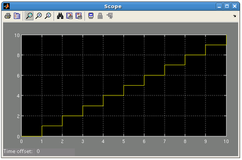

The one connected to your adder should return a constant, equal to the sum of the two numbers you entered. You might have to press the Autoscale button to scale the scope appropriately.


Once you have verified that that design functions as you'd like, you're ready to compile for the FPGA...

## Compiling
Essentially, you have constructed three completely separate little instruments. You have a flashing LED, a counter which you can start/stop/reset from software and also an adder. These components are all clocked off the same 156.25MHz system clock crystal and to your specified User IP Clock Rate, but they will operate independently.

In order to compile this to an FPGA bitstream, execute the following command in the MATLAB Command Line window. **THIS COMMAND DEPENDS WHICH PLATFORM YOU ARE TARGETING**:
``` bash
 >>  jasper
```
When a GUI pops up, click "Compile!". This will run the complete build process, which consists of two stages. The first involving Xilinx's System Generator, which compiles any Xilinx blocks in your Simulink design to a circuit which can be implemented on your FPGA. While System Generator is running, you should see the following window pop up:


After this, the second stage involves synthesis of your design through Vivado, which goes about turning your design into a physical implementation and figuring out where to put the resulting components and signals on your FPGA. Finally the toolflow will create the final output fpg file that you will use to program your FPGA. This file contains the bitstream (the FPGA configuration information) as well as meta-data describing what registers and other yellow blocks are in your design. This file will be created in the 'outputs' folder in the working directory of your Simulink model. **Note: Compile time is approximately 15-20 minutes**.


### Advanced Compiling
Once you are familiar with the CASPER toolflow, you might find you want to run the two stages of the compile separately. This means that MATLAB will become usable sooner, since it won't be locked up by the second stage of the compile. If you want to do this, you can run the first stage of the compile from the MATLAB prompt with
```bash
>> jasper_frontend
```
After this is completed, the last message printed will tell you how to finish the compile. It will look something like:
```bash
 'python /path_to/mlib_devel/jasper_library/exec_flow.py -m /home/user/path_to/snap/tut_intro/snap_tut_intro.slx --middleware --backend --software'
 ```
You can run this command in a separate terminal, after sourcing appropriate environment variables. Not recommended for beginners.

## Programming the FPGA
Reconfiguration of CASPER FPGA boards is achieved using the casperfpga python library, created by the SA-SKA group.

#### Getting the required packages

These are pre-installed on the server in the workshop and you do not need to do any further configuration. However, should you want to run these tutorials on your own machines, you should download the latest casperfpga libraries from [here.](https://github.com/casper-astro/casperfpga)

#### Copy your .fpg file to your Server

As per the previous figure, navigate to the outputs folder and (secure)copy this across to a test folder on the workshop server. Instructions to do this are available [here](https://casper.berkeley.edu/wiki/Casper_Caltech_Workshop_2017_Tutorials_Help_Page#Getting_your_designs_on_to_hardware_.3D)

#### Connecting to the board

SSH into the server that the SNAP board is connected to and navigate to the folder in which your .fpg file is stored.

Start interactive python by running:
 ipython

Now import the fpga control library. This will automatically pull-in the KATCP library and any other required communications libraries.
 import casperfpga

To connect to the board we create a CasperFpga instance; let's call it fpga. The CasperFpga constructor requires just one argument: the IP hostname or address of your FPGA board.

 fpga # casperfpga.CasperFpga('snap hostname or ip_address')

The first thing we do is program the FPGA with the .fpg file which your compile generated.

 fpga.upload_to_ram_and_program('your_fpgfile.fpg')

Should the execution of this command return true, you can safely assume the FPGA is now configured with your design. You should see the LED on your board flashing. Go check! All the available/configured registers can be displayed using:
 fpga.listdev()
The adder and counter can be controlled by [writing to](https://github.com/ska-sa/casperfpga/wiki/API-Documentation#write_int) and [reading from](https://github.com/ska-sa/casperfpga/wiki/API-Documentation#read_int) registers added in the design using:
 fpga.write_int('a',10)
 fpga.write_int('b',20)
 fpga.read_int('sum_a_b')

With any luck, the sum returned by the FPGA should be correct.

You can also try writing to the counter control registers in your design. You should find that with appropriate manipulation of the control register, you can make the counter start, stop, and return to zero.

 fpga.write_int('counter_ctrl',10')
 fpga.read_uint('counter_value')

## Conclusion
This concludes the first CASPER Tutorial. You have learned how to construct a simple Simulink design, program an FPGA board and interact with it with Python using [casperfpga](https://github.com/casper-astro/casperfpga). Congratulations!

While the design you made might not be very complicated, you now have the basic skills required to build more complex designs which are covered in later tutorials.